#

<!--more-->

- arxiv v1: 2023/3

- CVPR 2024
- [论文地址](https://arxiv.org/abs/2303.04761)

- [项目地址](https://github.com/dvlab-research/Video-P2P)

# 0. Abstract

- 本文提出Video-P2P， 一种具有交叉注意力控制的**真实世界视频编辑**新框架。  虽然注意力控制已被证明对使用预训练图像生成模型进行图像编辑有效，但目前还没有公开的大规模视频生成模型。 

>真实世界视频的区别在于需要用DDIM inversion获得初始$Z_T$，而非真实视频可以直接进行生成

- Video-P2P 通过采用图像生成扩散模型来完成各种视频编辑任务来解决这一限制。  具体来说，我们首先调整 Text-to-Set (T2S) 模型以完成一个**近似反演**（approximate inversion），然后优化一个**共享无条件嵌入**（shared unconditional embedding）以在较小的内存成本下实现准确的视频反演。 
- 对于注意力控制，我们引入了一种新颖的**解耦引导策略**，该策略对源提示词和目标提示词使用不同的引导策略。针对源提示词的优化无条件嵌入提高了重建能力，而针对目标提示词的初始化无条件嵌入则增强了可编辑性。结合这两个分支的注意力图可以实现详细编辑。 
-  这些技术设计支持各种文本驱动的编辑应用，包括单词交换、提示细化和注意力重新加权。Video-P2P 非常适合在真实视频上生成新角色，同时最佳地保留其原始姿势和场景。它的表现明显优于以前的方法。 

# 1. Introduction

- 视频生成和视频编辑是key tasks:
  -  Imagen video
  -  Video diffusion models
  -  Dreamix
  - Make-a-video
  - Phenaki

-  文本驱动的编辑是一个有前途的pipeline：
  - Prompt-to-prompt image editing with cross attention  control
  -  Imagic: Text-based real image  editing with diffusion models
  -  Null-text inversion for editing real images using guided diffusion  models

-  到目前为止，仅编辑视频中的局部对象仍然具有挑战性 。 本文提出了一种可以局部和全局编辑视频的pipeline，如图 1 和 5 所示。 

  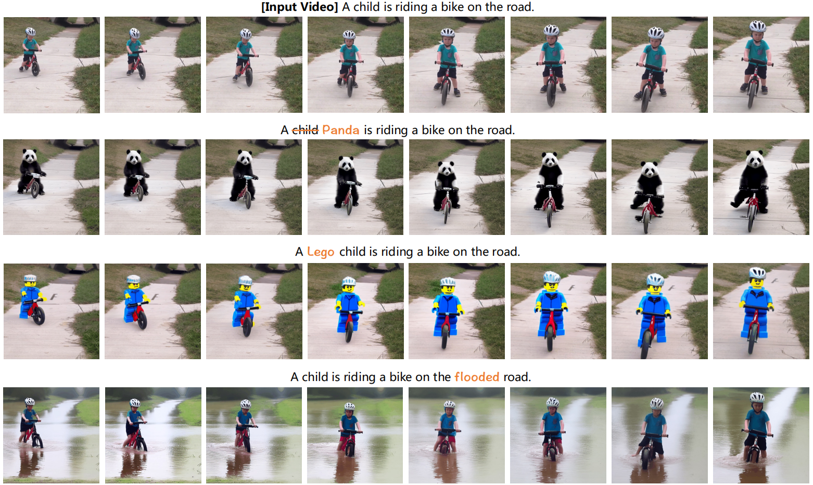

  

-  注意力控制是详细图像编辑最有效的pipeline
  - Prompt-to-prompt image editing with cross attention control
  - Null-text inversion for editing real images using guided diffusion  models
  -  为了编辑真实图像，该流程包括两个必要步骤： 
    1.  **使用预先训练的扩散模型将图像反演为潜在特征 **
    2. **在去噪过程中控制注意力图以编辑图像的相应部分**（ 例如，通过交换他们的注意力图，我们可以将“孩子”替换为“熊猫”。 ）

- 对于视频通过单帧处理（Image-P2P）使用预训练的图像扩散模型缺乏跨帧的语义一致性。为了保持语义一致性，我们建议通过将文本到图像扩散模型（T2I）转变为文本到集合模型（T2S），**对所有帧使用反演和注意力控制的结构**。这种方法是有效的，如第三行所示，其中 其中机器人企鹅保持了跨帧的一致性。 

  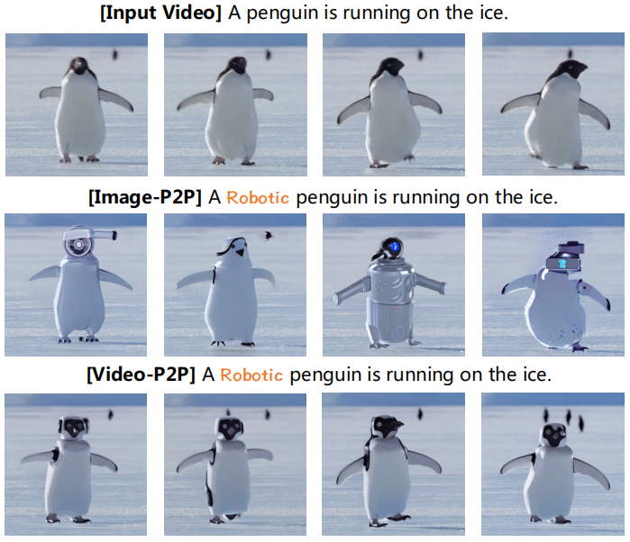

  

- 本文采用`Tune a video`的方法：**改变卷积核，使用跨帧注意力替换self-attention** ，将 T2I 模型转换为 T2S 模型。  这种转换产生了一个 能够生成一组语义一致的图像的模型。  生成质量将随着膨胀步骤而降低，但可以在原始视频上进行调整后恢复。  虽然调整后的 T2S 模型不是理想的视频生成模型，但它足以为视频创建近似反演（approximate inversion），如图 3 (c) 所示。这只是一个近似值，因为误差在去噪过程中积累，与 [20, 36] 中的结论一致。 

  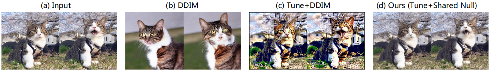

  

-  为了提高反演质量，我们建议优化所有帧的共享无条件嵌入，以使去噪潜在特征与扩散潜在特征对齐。 我们的实验表明，共享嵌入是视频反演最有效、最有效的选择。比较如图 3 所示。 

-  如 Prompt-to-prompt 所述，成功的注意力控制需要模型既具有重建能力，又具有编辑能力。 虽然已经有人认为图像反转具有这两种能力，但我们发现视频编辑带来了不同的挑战。  T2S 模型是一种未在任何视频上训练的膨胀模型，它对各种无条件嵌入引起的扰动不具有鲁棒性。虽然我们优化的嵌入可以实现重建，但更改提示可能会破坏模型的稳定性并导致生成质量低下。另一方面，我们发现具有初始化无条件嵌入的近似反转是可编辑的，但无法很好地重建。为了解决这个问题，我们提出了一种注意力控制中的解耦引导策略，对源和目标提示使用不同的引导策略。  具体来说，我们对源提示使用优化的无条件嵌入，对目标提示使用初始化的无条件嵌入。我们结合这两个分支的注意力图来生成目标视频。这两个简单的设计被证明是有效的，并成功完成了视频编辑。我们的贡献可以总结如下： 
  -  我们提出了第一个具有注意力控制的视频编辑框架。解耦引导策略旨在进一步提高性能。
  - 我们引入了一种高效且有效的视频反转方法，该方法具有共享无条件嵌入优化，可大幅改善视频编辑。

# 2. Relate Work

## 2.1 Text Driven Generation

- DALL-E，DDPM，GLIDE，DALLE-2，LDM
  - 本文使用预训练的ldm

- 文生视频
  -  GODIVA   首次将 VQ-VAE 引入 T2V 
  -  CogVideo   将 T2V 与 CogView-2 相结合，利用预先训练的文本转图像模型。 
  -  VDM  提出了一种时空 U-Net 来对像素进行扩散。 
  -  Imagen Video 使用级联扩散模型和 v 预测参数化成功生成高质量视频。
  - Phenaki 生成带有时变提示的视频。
  - Make-AVideo 将 T2I 模型的外观生成与视频数据中的运动信息相结合。
  - **虽然这些方法可以生成合理的短视频，但它们仍然包含伪影并且不支持真实世界的视频编辑。此外，目前大多数这些方法尚未公开。 **

-  已经提出了几种**单视频生成模型**。
  - 单视频 GAN 可以生成具有相似物体和动作的新颖视频，
  -  SinFusion [23] 使用扩散模型来提高泛化能力，但仅限于简单情况。
  - Tune-A-Video [39] 将图像扩散模型膨胀为视频模型，并对其进行调整以重建输入视频。它允许更改语义内容，但**时间一致性有限**。我们发现使用 DDIM 反演结果可以提高其时间一致性。但是，它**无法避免改变不相关的区域**。**我们调整了 TAV 的一些设计来进行模型初始化。 **

## 2.2 Text Driven Editing

-  生成模型在图像编辑方面表现出色 
  -  SDEdit [19] 向输入图像添加噪声，并使用扩散过程恢复编辑后的版本。
  - Prompt-toPrompt [11] 和 Plug-and-Play [33] 使用注意力控制来最大限度地减少对不相关部分的更改
  - Null-Text Inversion [20] 改进了真实的图像编辑。
  - InstructPix2Pix [4] 通过用户提供的指令实现灵活的文本驱动编辑。
  - Textual Inversion [8]、DreamBooth [30] 和 Custom-Diffusion [18] 学习个性化概念的特殊标记并生成相关图像 

- 最近，使用生成模型进行视频编辑取得了一些进展。
  - Text2Live [3] 使用 CLIP 编辑视频中的纹理，但在处理重大语义变化时遇到了困难。
  - Dreamix [21] 使用预先训练的 Imagen Video [12] 主干来执行图像到视频和视频到视频的编辑，同时还能够改变运动。 
  - Gen-1 [6] 在图像和视频上联合训练模型，以完成风格化和定制等任务。
  - 虽然这些方法可以修改视频内容，但它们的运行方式类似于引导生成，并且在编辑对象时倾向于同时修改所有区域。我们提出的方法允许使用在图像上预先训练的扩散模型进行局部编辑

# 3. Method

- 假设 V 是包含 n 帧的真实视频。我们采用 Prompt-to-Prompt 设置，引入源提示 P 和编辑提示 $P ^ ∗$，它们**共同生成**包含 n 帧的编辑视频$ V ^ ∗$。提示由用户提供。

-  为了实现视频编辑中的交叉注意力控制，我们提出了 Video-P2P，这是一个具有两项关键技术设计的框架：

  1. 优化用于视频反转的共享无条件嵌入
  2. 对源提示和编辑提示使用不同的指导，并结合它们的注意力图。该框架如图 4 所示。

  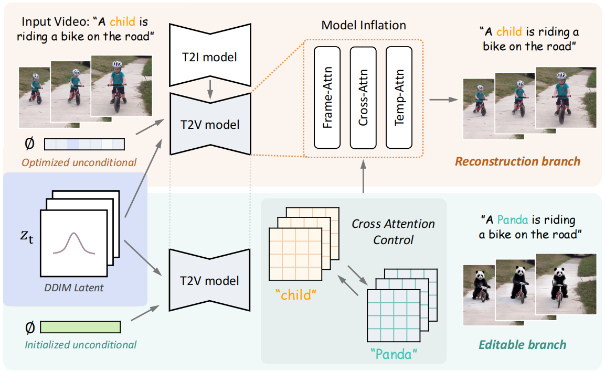

  

## 3.1 Preliminary

### 3.1.1 LDM

### 3.1.2 DDIM spampling and inversion



### 3.1.3 Null-text inversion

## 3.2 Video Inversion

- 我们首先构建一个能够执行近似反演的 T2S 模型。遵循 VDM 基线 [12, 15] 和 TAV [39]，我们使用 1×3×3 模式卷积核和时间注意。此外，我们用帧注意取代自注意，帧注意将**第一帧 v0 和当前帧 vi 作为输入**， 更新帧vi的特征：
  $$
  Q = W^ Q v_ i, K = W^ K v_ 0, V = W^ V v_ 0
  $$

-  该模型逐对处理视频，并计算 n 次以获得每帧的预测。**虽然 TAV [39] 中提出的 Sparsecausal 注意力机制在从随机噪声生成视频时优于帧注意力机制，但我们发现简单的设计足以进行视频反转，因为反转的潜在特征可以捕获时间信息。此外，帧注意力机制可以节省内存并加快处理速度。**

- 虽然模型膨胀有助于保持帧间语义一致性，但它会对 T2I 模型的生成质量产生不利影响。这是因为自注意力参数被用于计算帧相关性，而这些参数尚未经过预训练。因此，通过膨胀生成的 T2S 模型不足以进行近似反演，如图 2 所示。为了解决这个问题，我们**根据 tune a video 对帧和交叉注意力的查询投影矩阵 WQ 以及额外的时间注意力进行了微调**，以根据输入视频执行噪声预测。经过此初始化后，T2S 模型能够生成语义一致的图像集，同时保持每帧的质量，从而成功实现近似反演。

- 使用经过微调的 T2S 模型，我们通过**优化共享无条件嵌入**来执行视频反转。 在反转过程中，每个潜在特征 zt 包含维度为 n 的帧的通道，其中 $z_ { t  , i }$ 表示第 i 帧的潜在特征。我们使用 DDIM 反转来生成潜在特征 $z ^ ∗ _ 0 ; ... ; z^ ∗ _ T$ 。

- 无条件嵌入被定义为：
  $$
  \min \limits_{ \varnothing_ t } \sum_ { i = 1 } ^ n || z^ * _ { t - 1 , i } - z_ { t - 1 , i} (\bar z_ { t, i} , \bar z _ { t, 0 }, \varnothing_ t, C ) ||_ 2 ^ 2
  $$

  - 其中$\bar z_ { t - 1 , i} =  z_ { t - 1 , i} (\bar z_ { t, i} , \bar z _ { t, 0 }, \varnothing_ t, C ) $  在每个步骤中更新。T2S 模型的帧注意使用两个潜在特征来计算下一步的相应特征。注意 $\varnothing _ t$由所有帧 (i = 1, ... , n) 共享，从而最大限度地减少了内存使用量。此外，对所有帧使用相同的无条件嵌入可避免破坏注意力控制中的语义一致性。 

## 3.3  解耦引导注意力控制 

- 为了对真实图像进行注意力控制，现有研究 [11, 20] 需要具有重建能力和可编辑性的推理pipeline。然而，为 T2S 模型实现这样的pipeline具有挑战性。视频反演使我们能够建立推理管道以很好地重建原始视频。然而，由于缺乏对视频的预训练，T2S 模型不如 T2I 模型那么健壮。因此，优化的无条件嵌入会损害其可编辑性(its editability is compromised with the optimized unconditional embedding)，导致更改提示时生成质量下降。相反，我们发现使用初始化的无条件嵌入可以使模型更具可编辑性，但无法完美地重建。这启发我们将两个推理管道的能力结合起来。**对于源提示，我们在无分类器指导中使用优化的无条件嵌入。对于目标提示，我们选择初始化的无条件嵌入。**然后，我们结合这两个分支的注意力图来获得编辑后的视频，其中**不变的部分受到源分支的影响，而编辑的部分受到目标分支的影响。**

- 算法如下

  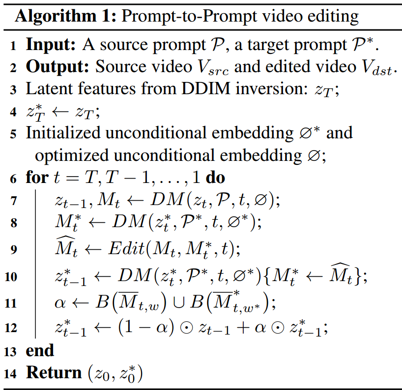

  

  - 我们采用了从 Image-P2P 到 Video-P2P 的注意力控制方法。 例如，为了执行**单词交换**，Edit 函数可以表示为： 
    $$
    Edit(M_t, M _ t ^ *, t) := \left\{ \begin{matrix}M_ t ^ * &if t< \tau \\\\ M_ t &otherwise\\\end{matrix}\right.
    $$

    - $M_ t$和$M_ t^ *$ 是每一步每帧的交叉注意力图，$DM$ 是调整后的 T2S 模型。更改帧注意力图对最终结果的影响很小。注意力图仅在前$\tau$ 步交换，因为注意力是在早期形成的。$\bar M _ { t, w }$ 是在步骤 t 计算的单词 $w$ 的平均注意力图。它是在步骤 T, ... , t 上对每一帧独立取平均值。对于第 j 帧，我们计算： $\bar M _ { t, w , j }=\frac{ 1 }{ T - t } \sum_ { i =  t } ^ T \bar M _ { i, w , j} \space \space , \space \space j=1, ...,n$
    - $B( \bar M _ { t, w })$  表示从注意力图中得到的二值掩码。当大于阈值时，将值设置为 1。 

    

# 4. 实验

## 4.1 实验细节

- 我们基于CompVis Stable Diffusion（v1-5）
- 与TAV【39】类似，我们固定图像自动编码器，并以512 × 512的分辨率从视频中采样8或24帧。
- 为了初始化模型，我们将T2S模型微调500步，以重建原始视频。
- 在注意力控制过程中，我们将交叉注意力替代比设置为0.4，注意力阈值设置为0.3。
- 对于提示词细化，我们将细化比率设置为0.4。可以调整这些参数以控制不同示例的编辑保真度。
- 所有8帧实验均在单个V100 GPU上进行，初始化（调优）时间为5分钟，反转时间为6分钟，推理时间为1分钟。

## 4.2 应用

### 4.2.1 单词交换。

- Video-P2P支持基于单词交换的实体替换，同时保持不相关区域的一致性。如图5所示，Video-P2P无缝地用蜘蛛侠替换摩托车上的人，同时最小化摩托车外观的变化(第4行)。生成的蜘蛛侠显示出跨帧的一致外观，背景保持不变。此外，我们可以用一只猫代替一只狗，同时保留它的手势和周围的草（第五排）。

  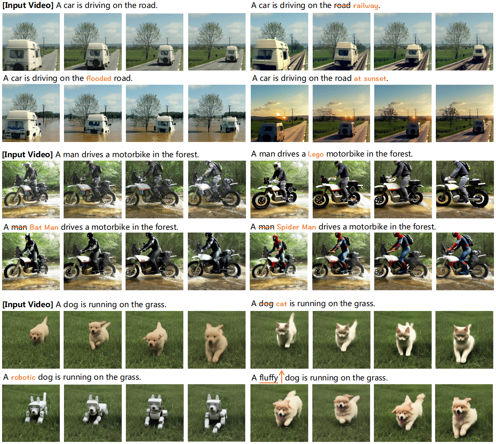

  

### 4.2.2 提示词细化

- Video-P2P能够进行提示细化，例如修改对象属性。例如，我们可以将走狗改造成机器狗（图5中的第6行），并将摩托车改造成具有相同运动的乐高玩具（第3行）。注意草地和天空几乎不受影响。此外，Video-P2P可以执行全局编辑，如将天气更改为日落或用水淹没道路（第二排）。风格转移也可以通过视频P2P来完成，例如将视频转换成水彩画。

### 4.2.3 注意力重新加权

- 与Image-P2P类似，Video-P2P也实现了注意力重加权。通过调整特定单词的交叉注意，我们可以操纵相应生成的程度。例如，我们可以调节视频中狗的蓬松程度（图5的第6行）。

## 4.3 比较

### 4.3.1 与TAV比较

- TAV+DDIM[39]和我们的Video-P2P都允许使用文本提示进行视频编辑。然而，TAV+DDIM在编辑特定对象时无法避免更改整个视频内容，而Video-P2P可以编辑局部区域并将对其他区域的影响降至最低。图6（左）展示了当用金刚替换狮子时，Video-P2P保留了云的复杂形状，而TAV+DDIM在这种情况下只能保持天空的色调。

  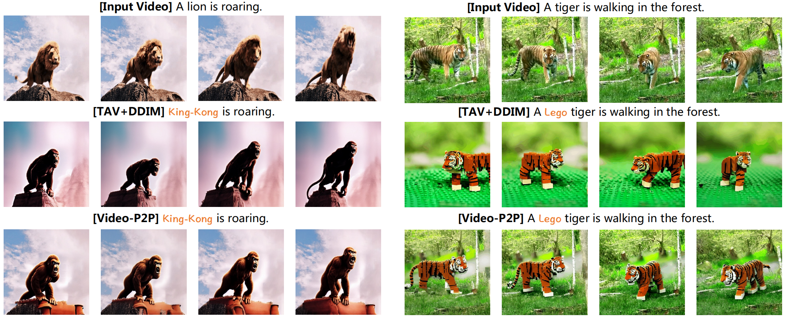

  

- 虽然我们的模型初始化类似于TAV，但Video-P2P仍然可以在TAV+DDIM失败的情况下生成时间一致的结果。如图6(右)所示，即使当输入是来自DDIM反转的特征时，TAV也难以在第二行中生成时间一致的序列。相比之下，我们的方法可以产生更好的结构保留结果，如第三行所示。

### 4.3.2 与Dreamix比较

- 与Dreamix【21】相比，Dreamix【21】使用不公开的预训练视频扩散模型，我们的方法在物体替换方面产生了更好的结果。虽然我们的方法由于缺乏时间先验而不能执行视频运动编辑，但我们在保留细节和动作一致性方面优于Dreamix。由于Dreamix不是开源的，我们对其发布的演示进行了评估。如图7所示，两种方法都可以将两只狗转换成两只猫，但是我们的方法保留了背景中抽屉的细节（第3行）。此外，Dreamix可能会在一定程度上影响时间顺序（time sequence），因为生成的猫比视频中的原始狗移动得更慢。相比之下，我们的方法完全保留了原始视频的运动。

  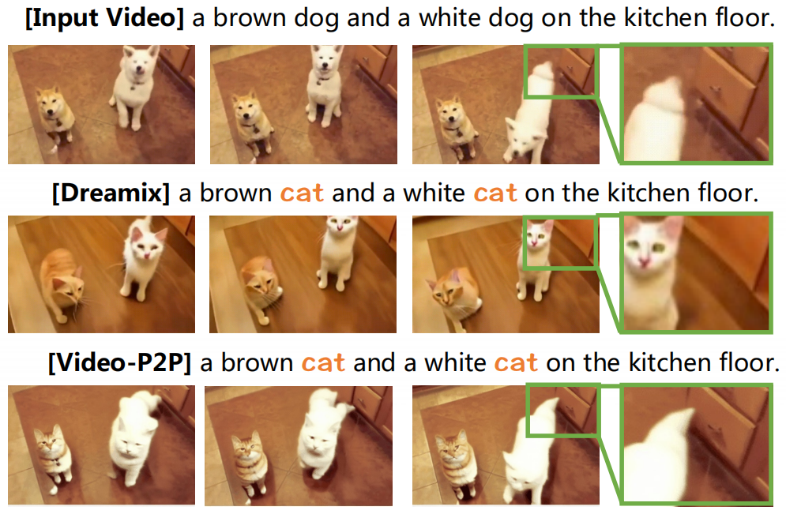

  

### 4.3.3 定量结果

- 我们在10个YouTube视频上评估了我们提出的VideoP2P，并报告了四个指标进行定量分析。

- CLIP Score衡量文本提示和视频之间的文本相似性，

  - 我们选择官方的ViT-BasePatch16 CLIP模型，并使用输出的logits作为CLIP评分输出。此外，我们应用标准的VGG [36]提取器进行LPIPS特征提取。

- Masked PSNR和LPIPS【41】评估结构保留的质量。

  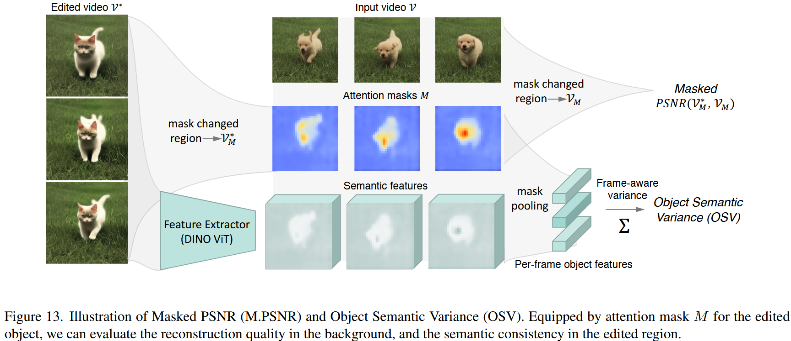

  

  - 为了评估编辑视频中局部结构的保留，我们提出了掩膜峰值信噪比（M.PSNR），它通过测量不相关区域的低级像素距离来补充LPIPS [51]。如图13所示，给定变化对象的平均注意力掩码序列M，我们通过比较编辑视频$V^*$和输入视频$V$中不相关区域的像素距离来计算掩膜峰值信噪比。:
    $$
    M.PSNR(V ^ * , V) = PSNR( B ( V^ * , M ), B( V, M ))
    $$

    - 我们定义 B(V, M) = VM 为一个阈值为 0.3 的反向掩码二进制函数，因此在 Masked PSNR 计算中只考虑无关区域。

- 我们还提出了一种新的度量，对象语义方差(Object Semantic Variance)（OSV），来测量跨帧的语义一致性。有关这些指标的详细说明，请参阅附录。

  - 评估跨帧内容一致性在编辑后对象结构发生变化时具有挑战性。受到最近在3D渲染领域的研究启发，我们引入了对象语义方差（OSV），它通过计算编辑区域的逐帧特征方差来衡量视频序列的语义一致性。我们使用DINO-ViT $F_\theta$提取特征图，作为对象的感知指导。如图13所示，OSV的计算方式为
    $$
    OSV( V^ *, M) = \sum^ c Var( \sum^ {h, w} (M \cdot F_ \theta ( V^ * ) ) )
    $$

    - 其中Var里面的是由大小为[n，h，w]的归一化掩模M加权的特征图空间池。然后计算跨帧的方差，我们累加所有c维度以获得OSV。图14在视频编辑方法中逐个比较OSV。值得注意的是，除了超越其他方法之外，Video-P2P编辑的视频与现实世界的输入视频具有相当的语义一致性。

- 如表1所示，我们的结果表明，视频P2P在所有指标上都表现良好。与TAV+DDIM相比，Video-P2P实现了更高的掩蔽PSNR和更低的LPIPS，表明更好地保留了未改变的区域。与其他两种方法相比，Video-P2P具有低得多的OSV，表明其在跨帧保持语义一致性方面具有优越的能力。此外，在表3中，我们报告了用户研究结果，其中Video-P2P平均排名第一，与其他方法相比具有较高的偏好率。(DG表示解耦引导)

  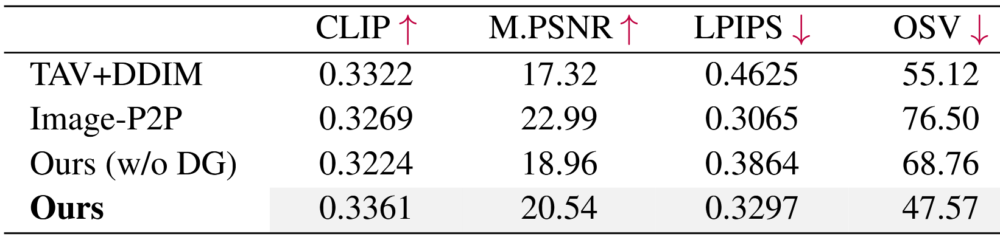

  

  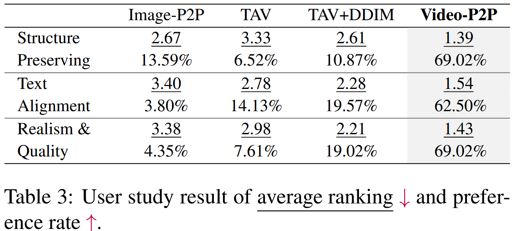

  

## 4.4 Ablation

### 4.4.1 模型初始化

- 虽然膨胀图像扩散模型可以生成语义一致的图像，但T2S模型的生成能力在膨胀期间受到损害，即使使用优化的无条件嵌入，其也不足以用于视频反转。如图8（第三列）所示，直接使用膨胀的T2S模型会产生背景不准确的不切实际的结果。为了缓解这种情况，我们通过微调给定的视频来初始化T2S模式。这在图8（第4列）中很明显，其中猫的外观得到改善，草重建变得更加准确。

  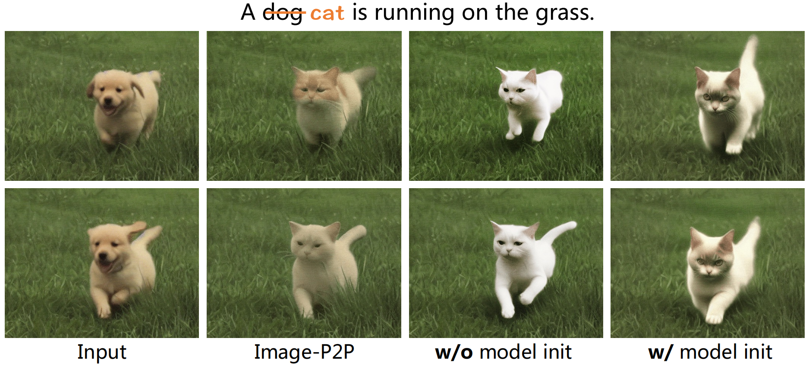

  

### 4.4.2 共享无条件嵌入

- 表2给出了视频反演的定量结果。我们观察到，与TAV+DDIM相比，优化共享无条件嵌入可以显著提高PSNR。然而，对于每个帧使用多个无条件嵌入仅将PSNR增加0.2，但导致更高的参数使用(n倍)。此外，我们发现，与共享无条件嵌入相比，使用多个无条件嵌入在注意力控制后导致20.51的较低掩蔽PSNR。因此，我们得出结论，共享无条件嵌入是视频反演最有效和高效的方法。

  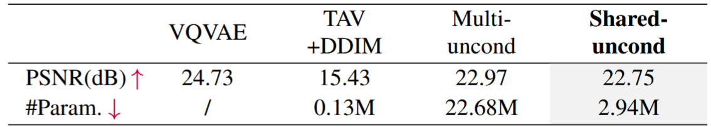

  

### 4.4.3 解耦引导注意力控制

- 为了获得输入视频的潜在特征，我们使用源提示优化了无条件嵌入。需要注意的是，这种嵌入只适用于在prompt-to-prompt过程中的源提示词。对目标提示词使用优化的嵌入可能会负面影响生成结果的质量，如图9(第一行)所示。相反，我们利用目标提示的初始化无条件嵌入，并合并来自两个分支的注意力图。解耦引导注意力控制方法显著提高了编辑质量，如图9（第二行）所示。定量消融可在表1中找到。（第三排和第四排）。

  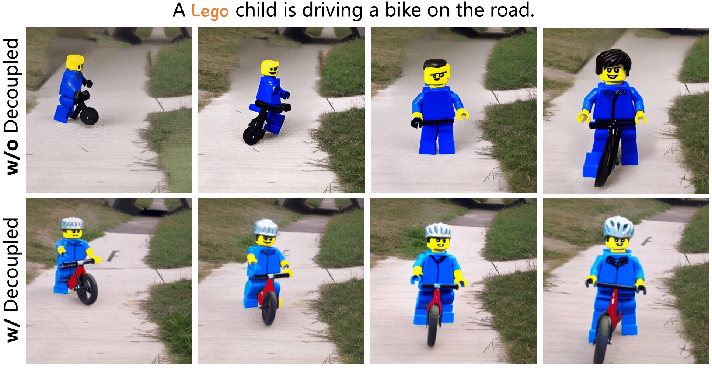

  

# 5. Conclusion

- 我们提出的方法Video-P2P为具有交叉注意力控制的视频编辑提供了一种简单而有效的解决方案。通过利用预训练的图像扩散模型，我们证明了本地和全局编辑视频是可能的。具体来说，我们基于用于视频反转的良好初始化的T2S模型优化了共享无条件嵌入。我们还建议对源和目标提示使用不同的无条件嵌入，并**集成来自两个分支的注意力图以改进注意力控制**。这些技术使Video-P2P能够执行各种应用，例如单词交换、提示细化和注意力重新加权。在未来的工作中，我们将增强它处理更复杂编辑任务的能力，如注入额外的对象。