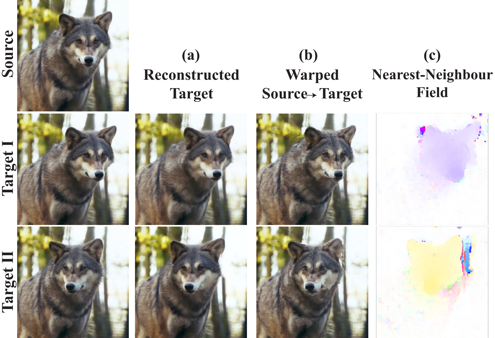
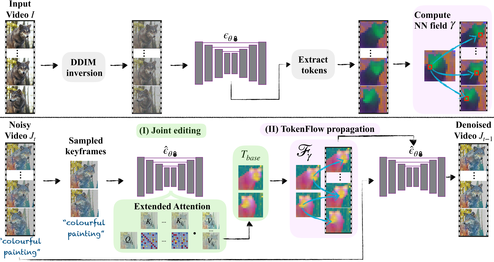
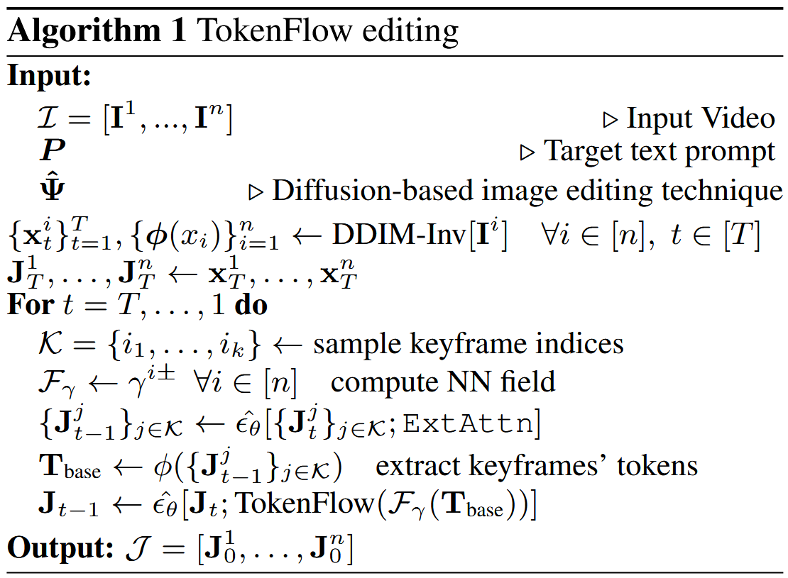

#

<!--more-->

- arxiv v1: 2023/7   v3: 2023/11

- ICLR 2024
- [论文地址](https://arxiv.org/abs/2307.10373)
- [项目地址](https://github.com/omerbt/TokenFlow)

# 0. Abstract

- 生成式人工智能革命最近扩展到了视频领域。然而，就视觉质量和用户对生成内容的控制而言，当前最先进的视频模型仍然落后于图像模型。在这项工作中，我们提出了一个框架，**利用文本到图像扩散模型的力量来完成文本驱动的视频编辑任务**。具体来说，给定源视频和目标文本提示，我们的方法生成坚持目标文本的高质量视频，同时**保留输入视频的空间布局和运动**。我们的方法基于一个**关键的观察结果**，即**编辑视频中的一致性可以通过在扩散特征空间中实施一致性来获得**。我们通过**基于帧间对应关系显式传播扩散特征来实现这一点**，这在模型中很容易获得。因此，我们的框架**不需要任何训练或微调**，可以与任何现成的文本到图像编辑方法结合使用。我们在各种真实视频上展示了最先进的编辑结果。

# 1. Introduction

- 现有方法的缺陷：
  - **大规模文本到视频生成模型激增，在仅从文本描述生成剪辑方面展示了令人印象深刻的结果。然而，尽管在这一领域取得了进展，现有的视频模型仍处于起步阶段，在分辨率、视频长度或它们可以表示的视频动态的复杂性方面受到限制。**

- 我们的目标是生成符合输入文本提示所表达的目标编辑的高质量视频，同时**保留原始视频的空间布局和运动**。
- 利用图像扩散模型进行视频编辑的主要挑战是**确保编辑的内容在所有视频帧中保持一致**——理想情况下，3D世界中的每个物理点都会随着时间的推移进行连贯的修改。基于图像扩散模型的现有和并发视频编辑方法已经证明，**通过将自我注意模块扩展到包括多个帧，可以实现跨编辑帧的全局外观一致性**（TAV, Text2video-zero, Pix2video, Fatezero）
- 基于时空注意力方法的缺陷：
  - 然而，这种方法不足以实现期望的时间一致性水平，**因为视频中的运动仅通过注意力模块隐式地保留**。因此，专业或半专业用户经常求助于复杂的视频编辑管道，这需要额外的手动工作。
- 在这项工作中，我们提出了一个框架，通过**显式地加强编辑上的原始帧间对应性**来解决这一挑战。直观地，**自然视频包含跨帧的冗余信息**，例如，描绘**相似的外观和共享的视觉元素**。我们的关键观察是，**扩散模型中 视频的内部表示 表现出类似的属性**。也就是说，**RGB空间和扩散特征空间中的帧的冗余水平和时间一致性是紧密相关的**。基于这一观察，**我们方法的支柱是通过确保 *结果视频的特征* 跨帧一致来实现一致的编辑**。具体来说，我们**强制编辑的特征传达与原始视频特征相同的帧间对应和冗余**。为此，我们利用**原始帧间特征对应关系** （这种对应关系是模型容易获得的）。这导致了一种有效的方法，该方法可以**直接基于原始视频动态****传播edited diffusion特征** 。这种方法允许我们利用最先进的**图像扩散模型**的生成先验，而无需额外的训练或微调，并且可以与现成的基于扩散的图像编辑方法结合工作（例如，SDEdit；prompt2prompt；controlnet；plug and play）。总而言之，我们做出了以下主要贡献：
  - 一种被称为TokenFlow的技术，它强制跨帧扩散特征的语义对应，允许显著增加由文本到图像扩散模型生成的视频的时间一致性。
  - 研究视频中扩散特征特性的新颖实证分析。
  - 对不同视频进行最先进的编辑结果，描绘复杂的运动。

# 2. Related Work

## 2.1 文生图&文生视频

利用预先训练的图像扩散模型进行视频合成任务，无需额外训练

- Scenescape
- TAV
- Shape-aware textdriven layered video editing
- Fatezero

## 2.2 一致的视频风格化

- 常见方法包括在逐帧的基础上应用图像编辑技术（例如，风格转移），然后进行后处理阶段，以解决编辑视频中的时间不一致（Learning blind video temporal consistency；Blind video temporal consistency via deep video prior；Blind video deflickering by neural filtering with a flawed atlas）。
- 尽管这些方法有效地减少了高频时间闪烁，但**它们并没有被设计成处理在内容上表现出实质性变化的帧**（they are not designed to handle frames that exhibit substantial variations in content），这在应用基于文本的图像编辑技术时经常发生（Fatezero）
- Layered neural atlases for consistent video editing. 提出将视频分解成一组2D图谱，每个图谱在整个视频中提供背景或前景对象的统一表示。应用于2D地图集的编辑会自动映射回视频，从而以最小的努力实现时间一致性。Text2live；Shape-aware text-driven layered video editing demo利用这种表示来执行文本驱动的编辑。然而，图谱表示仅限于具有简单运动的视频，并且需要长时间的训练，限制了该技术和基于该技术的方法的适用性。
- 我们的工作也与经典工作有关，这些工作证明了**自然视频中的小块在帧之间广泛重复**（Space-time super-resolution from a single video；Video epitomes），因此一致的编辑可以通过 *编辑关键帧的子集并通过使用手工制作的特征和光流建立补丁对应关系在整个视频中传播编辑*  （Artistic style transfer for videos；Stylizing video by example）或  *通过训练基于补丁的GAN* （Texler等人，2020年）
- 然而，这种传播方法难以处理**具有照明变化或具有复杂动态**的视频。重要的是，它们依赖于用户提供的关键帧的一致编辑，这仍然是尚未自动化的劳动密集型任务。rerender a video将关键帧编辑与Stylizing video by example的传播方法相结合。他们使用文本到图像扩散模型编辑关键帧，同时对编辑的关键帧实施光流约束。**然而，由于远距离帧之间的光流估计不可靠，他们的方法无法一致地编辑相距很远的关键帧**（如我们的补充材料-SM中所见），因此无法一致地编辑大多数视频。

- 我们的工作与这种受益于自然视频中时间冗余的方法有着相似的动机。我们表明，这种冗余也存在于文本到图像扩散模型的特征空间中，并利用这一特性来实现一致性。

## 2.3 通过扩散特征操纵的受控生成

- 最近，大量工作展示了文本到图像扩散模型如何通过对扩散网络的中间特征表示执行简单的操作来轻松适应各种编辑和生成任务（Attend-and-excite: Attention-based semantic guidance for text-to-image diffusion models；Improving sample quality of diffusion models using self-attention guidance；Directed diffusion；Plug-and-play diffusion features for text-driven image-to-image translation；Prompt-to-prompt；Localizing object-level shape variations with text-to-image diffusion models；Masactrl: Tuningfree mutual self-attention control for consistent image synthesis and editing）。
- Diffusion hyperfeatures: Searching through time and space for semantic correspondence;   A tale of two features: Stable diffusion complements dino for zero-shot semantic correspondence.演示了使用扩散特征对应的语义外观交换。Prompt-to-prompt观察到，通过操纵交叉注意层，可以控制图像的空间布局与文本中每个单词之间的关系。Plug-and-Play Diffusion分析了空间特征和self attention map并发现它们以高空间粒度捕获语义信息。
- Tune-A-Video观察到，通过扩展自我注意力模块以在不止一个帧上操作，有可能生成共享共同全局外观的帧。Fatezero; Pix2video; Text2video-zero；Edit-a-video; Video-p2p利用这一属性来实现全局一致的视频编辑。然而，如第5节所示，**膨胀自我注意模块不足以实现细粒度的时间一致性**。先前和并发的作品要么损害视觉质量，要么表现出有限的时间一致性。在这项工作中，我们还**通过在预训练的文本到图像模型的特征空间中的简单操作来执行视频编辑**，我们明确鼓励模型的特征通过TokenFlow在时间上保持一致。

# 3. 基础

## 3.1 Diffusion Models

## 3.2 Stable Diffusion

# 4. Method

- 给定
  - 视频$\mathcal  I = [I^ 1, \cdots, I^n ] $ 
  - 文本提示词：$\mathcal P$ （描述目标编辑）

- 目标：生成编辑视频$\mathcal J = [J^1, \cdots, J^n]$ , 该视频遵守提示词$\mathcal P$，同时保持原始视频$\mathcal I$的**运动和语义布局** 为了实现这一点，我们的框架利用了预训练和固定的文本到图像扩散模型$\epsilon _ \theta$。

- 通过在每一帧上独立地应用图像编辑方法（Prompt-to-prompt； Plug-and-play；SDEdit；controlnet），导致跨帧的内容<u>不一致</u>（例如，图3中栏）。我们的关键发现是，**在编辑过程中，可以通过加强跨帧的内部扩散特征之间的一致性来缓解这些**<u>**不一致性**</u>。(these inconsistencies can be alleviated by enforcing consistency among the internal diffusion features across frames, during the editing process)

  

  

  >跨时间的扩散特征
  >
  >- 左：
  > - 给定一个输入视频（第一行），使用DDIM inversion处理每一帧，在这个过程中 从网络$\epsilon_ \theta$的decoder部分的最高分辨率层提取出特征图。
  > - 对特征图（self-attention模块的输出tokens）使用PCA处理（提取出最高层self-attention的输出，假设是一个（batch, 4096,320)的特征矩阵，这里4096=64*64可以排列成一张图，320是通道数，这里的pca是从320个通道中选择3个通道），然后可视化前三种成分。（第二行）
  > - 同时将一个$x - t$切片（图中原始视频上的红线）可视化（RGB和latent feature都有）  （这一行的目的是什么？？？
  > - 特征表示在时间上是一致的——从整个视频上看，对应的区域用相似的特征进行编码。（corresponding regions are encoded with similar features across the video）
  >- 中间：
  > - 通过在每个帧上应用图像编辑方法（Plug-and-play）获得的编辑视频的帧和特征可视化；RGB中的不一致图案在特征空间中也很明显（例如，在狗的身体上）。
  >- 右图：
  > - 我们的方法强制编辑后的视频传达与原始视频相同级别的特征一致性，这转化为RGB空间中连贯且高质量的编辑。

- 自然视频通常描绘随时间变化的连贯和共享内容。我们观察到**$\epsilon_ \theta$中 自然视频的内部表示** 具有类似的性质。这在图3中示出，其中我们可视化从给定视频 ( 第一列 ) 提取的特征。如图所示，`Features `描绘了一个 **跨帧的共享的且一致的 表示**，即，**对应区域展现类似的representation**。

- 我们进一步观察到，**原始视频特征 使用简单的最近邻搜索 提供帧之间的细粒度对应**（图2）。此外，我们表明这些相应的特征对于扩散模型是可互换的——我们可以通过用附近帧中的相应特征交换<u>一个帧</u>的特征来忠实地合成该帧（图2（a））。（Moreover, we show that these corresponding features are interchangeable for the diffusion model – we can faithfully synthesize one frame by swapping its features by their corresponding ones in a nearby frame (Fig 2(a)).）

  

  

  >细粒度特征对应。
  >
  >从源帧中提取的特征( 即，来自自我注意模块的output tokens ) 被用于**重建附近的帧**。这是通过以下方式完成的：
  >
  >​	(a) 在所有层和所有生成时间步中 将target中的每个<u>特征</u>（假设target的特征为4096，320,320表示他有320个通道，320个特征） 与source中离<u>他</u>最近的特征交换（swapping each feature in the target by its nearest feature in the source）（从source的特征中找到一个特征f1，与当前target的当前特征f2最相近，将f2换成f1)
  >
  >​	(b) 在RGB空间中的简单warp，使用一个最近领域
  >
  >​	(c) 该最近邻域是 使用从最高分辨率解码器层提取的source和target特征之间计算的
  >
  >target被忠实地重建，展示了特征之间的高水平空间粒度和共享内容。
  
- 然而，当编辑被单独地应用于每个帧时，特征的一致性被破坏（图3中栏）。这意味着RGB空间中的一致性水平与帧的内部特征的一致性相关。因此，**我们的关键思想是操纵 edited视频 的特征，以保持原始视频特征的一致性水平和帧间对应性。**

- 如图4所示，我们的框架**在每个生成时间步中 在两个主要组件之间交替**：
  1. 采样一组关键帧并根据P联合编辑它们；该阶段导致跨关键帧的共享全局外观，
  2. 以及基于由原始帧特征提供的对应关系将特征从关键帧传播到所有帧。该阶段明确地保留了原始视频特征的一致性和细粒度共享表示。
- 这两个阶段都是结合图像编辑技术$\hat \epsilon_ \theta$完成的（例如， Plug-and-play  ）。直观地，在关键帧编辑和传播之间交替的好处是双重的：
  - 首先，在每个生成步骤对随机关键帧进行采样增加了对特定选择的鲁棒性。(first, sampling random keyframes at each generation step increases the robustness to a particular selection. )
  - 其次，由于每个生成步骤都会产生更一致的特征，因此下一步骤中的sampled keyframes将被更一致地编辑。(Second, since each generation step results in more consistent features, the sampled keyframes in the next step will be edited more consistently.)

## 4.0 预处理

- 提取扩散特征：

  - 给定一个输入视频$\mathcal I$，我们应用DDIM反转（见第3节）在每个帧$\mathcal I^ i$上，这产生一系列$[x_ 1 ^ i, \cdots, x_ T ^ i]$。对于每个生成时间步长t，我们将每个帧的潜在$x_ t ^ i$送到模型中，并从网络$\epsilon_ \theta$中每个层的自我注意模块中提取tokens$\phi ( x _ t ^ i )$（图4，顶部）。我们稍后将使用这些令牌来建立扩散特征之间的帧间对应关系。

  >- 代码的预处理只是得到了inversion的$x_ t$
  >- 这里提取的token应该是包含两类：self-attn的**输入特征**和**输出特征**。输入特征用于计算原始的帧间对应关系，将这个关系应用到输出特征上得到新的输出特征。

## 4.1 关键帧采样与联合编辑

- 我们的观察表明，给定单个编辑帧的特征，我们可以通过将其特征传播到它们相应的位置来生成下一帧。（we can generate the next frames by propagating its features to their corresponding locations）然而，大多数视频不能由单个关键帧来表示。为了说明这一点，我们考虑多个关键帧，从中我们获得一组特征（令牌）$T_ {base}$，该特征稍后将传播到整个视频。具体来说，在每个生成步骤，我们**以固定的帧间隔随机采样**（**代码中貌似是先将帧划分成等距的n段，然后每段里面都随机找一个帧**）一组关键帧$ \{ J ^ i \} _ {i \in k }$（详见SM）。我们通过扩展自我注意块来共同编辑关键帧，以同时处理它们（TAV），从而鼓励它们共享全局外观。更详细地，修改块的输入是来自所有关键帧$ \{ Q ^ i \}_ { i \in k } , \{ K ^ i \}_ { i \in k } , \{ V ^ i \}_ { i \in k }$的自我注意特征，其中Qi，Ki，V i是帧$i \in κ，κ={i_ 1，... i_ k }$的查询、键和值。所有帧的键都是级联的，扩展注意力是：
  $$
  \hat A = ExtAttn ( Q ^ i ; [ K ^ { i _ 1 } , \cdots, K ^ { i _ k }] ) = softmax \left (  \frac{ Q^ i [ K ^ { i _ 1 } , \cdots, K ^ { i _ k } ] ^ T }{ \sqrt { d } }   \right )
  $$
  
- 对于帧i的block的**输出**是：
  $$
  \phi( J ^ i ) = \hat A \cdot [ V ^ { i _ 1 } , \cdots, V ^ { i _ k } ]
  $$
  
- 直观地，每个关键帧查询所有其他关键帧，并从中聚合信息。这导致编辑帧中的外观大致统一（TAV,  Texttovideo-zero, Fatezero）。对于网络中的每一层，我们定义$T_ { base } = \{ \phi ( J ^ i ) \}_ { i \in k }$（图4底部中间）。

## 4.2 通过Tokenflow编辑传播

- 给定Tbase，我们基于从原始视频中提取的token对应关系在视频中传播它。在每个生成步骤t，我们计算每个原始帧的令牌$\phi ( x_ t ^ { i } )$及其两个相邻的无关键帧令牌$\phi ( x_ t ^ { i + } )$、$\phi ( x_ t ^ { i - } )$的最近邻(NN)，其中i+是最近的未来关键帧的索引，i−是最近的过去关键帧的索引。表示得到的NN场$\gamma ^ + , \gamma^ -$:
  $$
  \gamma^ { i \pm } [p] = arg \min \limits_ { q } \mathcal D ( \phi ( x ^ i )[ p ] , \phi ( x ^ { i \pm } )[ q ] )
  $$

  - 其中，p、q是token特征图中的空间位置，D是余弦距离。为了简单起见，我们省略了生成时间步长t；我们的方法适用于所有时间步长和自我注意层。

- 一旦我们获得$\gamma ^ { i \pm }$，我们通过线性组合Tbase中的token，将其传播到视频的其余部分：
  $$
  \mathcal F_ \gamma ( T_ { base } , i, p ) = \omega_ i \cdot \phi ( J^ { i + } ) [ \gamma^ + [ p ] ] + ( 1 - \omega _ i ) \cdot \phi ( J ^ { i - } ) [ \gamma ^ { i - } [ p ] ]
  $$

  - 其中$\phi ( J ^ { i \pm }) \in T_ { base} , \omega_ i \in ( 0 ,  1 )$是与帧i与其相邻关键帧之间的距离成正比的标量（见SM），确保平滑过渡。注意，F对于关键帧也同样做修改。也就是说，我们修改自我注意块，以根据原始视频令牌对应关系为所有帧（包括关键帧）输出Tbase中的令牌的线性组合。

- 总体算法：

  - 我们首先对输入视频i执行DDIM反转，并提取所有帧$i \in [ n ]$的潜在噪声序列$\{ x ^ i _ t \}^ T _ { t = 1  } $（图4，顶部）。
  - 然后，我们对视频进行去噪，在关键帧编辑和令牌流传播之间交替（这是两次去噪过程）：
    - 在每个生成步骤t，我们随机化k<n个关键帧索引，并结合扩展注意力（等式。3，图4（I））使用图像编辑技术对它们进行去噪（例如，pnp，SDEdit，controlnet）。（这个去噪过程使用source, uncond, cond三个成分进行去噪，旨在获得当前时间步各个自注意力层的source的输入输入，up block的第5个resnet
    - 然后，我们通过将图像编辑技术与令牌流（等式5，图4（II））相结合来对整个视频Jt进行去噪。注意，每一层都包括自注意力块的输入和输出之间的剩余连接，因此在每一层执行Tokenflow是必要的。

  

  