#

<!--more-->

- SIGGRAPH 2024
- [论文地址](https://arxiv.org/abs/2312.03641)
- 

# 0. Abstract
- 视频中的运动：
    - 相机运动
    - 物体运动

- 现有的方法要么主要集中在一种运动上，要么对二者没有明确的区分，限制了它们的控制能力和多样性。

- 本文提出MotionCtrl，可以独立地控制相机和物体的运动。

- MotionCtrl的架构和训练方法是通过精心设计的，这考虑了相机运动和物体运动的固有特性，以及不完善的训练数据。

- 与之前方法相比，MotionCtrl的三个优势：
    - 它有效地，独立地控制相机和物体的运动，实现细粒度的运动控制。
    - 它的运动条件是由camera poses和轨迹决定的，这是无外观的，对生成的视频中物体的外观或形状的影响最小。
    - 它是一个相对通用的模型，一旦训练之后就可以适应广泛的相机姿态和轨迹

# 1. Introduction

- 文本到视频生成旨在制作符合给定文本提示的多样化高质量视频。与图像生成不同，视频生成需要在一系列生成的图像之间创建一致和流畅的运动。因此，运动控制在视频生成中起着至关重要的作用。

- 大多数与视频生成中的运动控制相关的先前工作要么主要关注其中一种运动，要么缺乏这两种运动之间的明确区分。
    - AnimateDiff，Gen-2, PikaLab主要使用独立的LoRA模型或额外的相机参数（例如PikaLab中的“-camera zoom in”）执行或触发相机运动。

    - VideoComposer和DragNUWA使用相同的条件实现摄像机运动和物体运动：

        - VideoComposer 中的运动矢量
        - DragNUWA 中的轨迹

    - 这两种运动之间缺乏明确的区别，阻碍了这些方法在视频生成中实现细粒度和多样化的运动控制。

- 本文提出MotionCtrl，能够以统一的模型独立控制摄像机和物体的运动。这种方法可以在视频生成中实现细粒度的运动控制，并促进两种运动类型的灵活和多样化组合。

- 实现本文的controller有两个challenge：

    - 相机和物体的运动在运动范围和模式上有很大的不同：
        - 相机运动指的是**整个场景在时间维度上的全局变换**，通常通过一系列相机姿势随时间的变化来表示。
        - 对象运动涉及场景中特定对象的时间运动，通常表示为**与对象相关的一组像素的轨迹**。

    - 没有现有的数据集包含伴随着一套完整的注释的视频剪辑，包括描述文本、相机姿势和物体运动轨迹。创建这样一个全面的数据集需要大量的努力和资源。

## MotionCtrl
- MotionCtrl部署了一个精心设计的**架构**，**训练策略**，精心挑选的**数据集**，它由两个部分组成：

    - 相机运动控制模块（CMCM）
        - 通过其时间转换器将一系列摄像机姿态在时间上集成到视频生成模型中，使生成的视频的全局运动与提供的摄像机姿态对齐。
    - 对象运动控制模块（OMCM）
        - 在空间上将物体运动的信息整合到视频生成模型的卷积层中，表明每个生成帧中物体的空间定位。
    - 他们都可以集成到现有的视频生成模型中。

- 本文使用的底层视频生成模型：VideoCrafter1（LVDM的增强版），本文称之为LVDM。

## 训练
- 对于配备了本文提出的两种适配器的大规模文本视频模型，我们可以单独训练这些模块，从而减少了对包含文字描述、相机姿势和物体运动轨迹注释的视频的综合数据集的需求。因此本文可以在两个数据集上实现MotionCtrl：
    - 一个数据集包含文字描述和物体运动轨迹 的注释，另一个包含文字描述和物体运动轨迹 的注释。
    - 本文引入了augmentedRealestate10k数据集，该数据集最初带有摄像机运动信息注释。我们通过使用Blip2生成字幕进一步增强了该数据集，使其适用于视频生成中的摄像机运动控制训练。
    - 此外，我们使用ParticleSfM中提出的运动分割算法合成的物体运动轨迹来增强来自WebVid的视频。除了原始的注释字幕外，增强的webvid数据集有助于学习视频生成中的对象运动控制。
    - 我们的MotionCtrl框架通过使用这两个带注释的数据集依次分别训练CMCM和OMCM，实现了在统一的视频生成模型中独立或联合控制摄像机和物体运动的能力。

- 三个优势
    - 独立控制摄像机和物体运动，实现细粒度调整和多种运动组合
    - 使用摄像机姿态和轨迹作为运动条件，不影响视觉外观，保持视频中物体的自然外观。
    - MotionCtrl可以控制各种摄像机运动和轨迹，而不需要调整每个单独的摄像机或物体运动

- 本文贡献：
    - 引入了用于视频生成的统一灵活的运动控制器MotionCtrl，旨在独立或联合控制生成视频中的摄像机运动和物体运动，实现更细粒度和多样化的运动控制。
    - 根据摄像机运动、物体运动和训练数据不完善的固有特性，精心定制了MotionCtrl的架构和训练策略，有效实现了视频生成中的细粒度运动控制。

# 2. Related Work

## 2.1 VideoCrafter1
- 编码器是使用sd的编码器处理每一帧，不包含时间信息
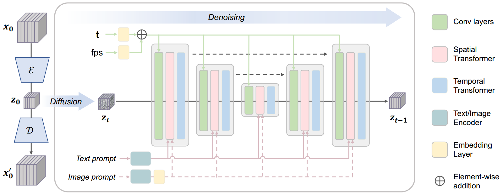

- spatial transformer和temporal transformer
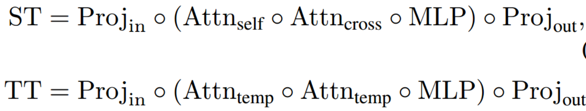

# 3. Methodology
## 3.1 LVDM

- latnet video diffusion model

    - 构建了一个轻量级的3D自编码器

## 3.2 MotionCtrl

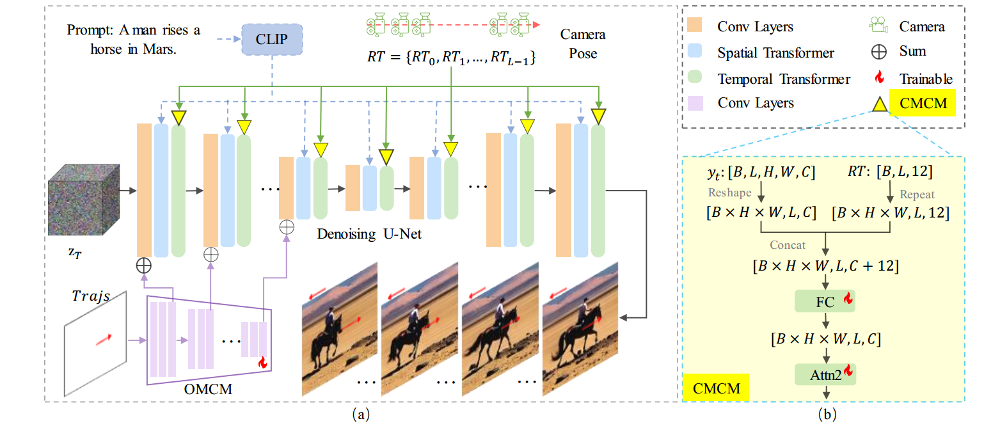

- CMCM和OMCM分别考虑到摄像机运动的全局特性和物体运动的局部特性

    - CMCM与LVDM中的temporal transformers相互作用
    - CMCM在空间上与LVDM中的卷积层相互配合

- 我们采用多个训练步骤来使MotionCtrl适应缺乏训练数据的情况，这些数据包含高质量的视频剪辑，并附有字幕、相机姿势和物体运动轨迹。

### 3.2.1 CMCM模块
- 几个全连接层组成的轻量级模块。由于摄像机运动是视频中帧与帧之间的全局变换，CMCM通过LVDM的temporal transformers与LVDM相配合

    - 通常，LVDM中的temporal transformers包含两个self attention模块，用于视频帧之间的时间信息融合。为了尽量减少对LVDM生成性能的影响，**CMCM只涉及temporal transformers中的第二个self attention模块**。

- CMCM需要一个相机姿势序列作为输入（$RT = \{RT_0 , RT_1, ... , RT_ { L-1 } \}$），本文中摄像机姿态由其**3*3旋转矩阵和3*1平移矩阵表示**。因此，$RT \in \mathbb{R}^{L \times 12}$，其中L是视频的长度，12是3*3+3*1。

    > 旋转矩阵和平移矩阵是什么？
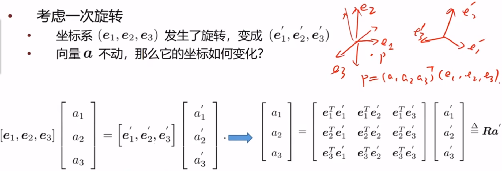

- 先将$RT$扩展维度到$H \times W \times L \times 12$，然后与第一个self attention模块的输出在最后一个维度进行concatenate。然后用一个全连接层将其映射到$H \times W \times L \times C$，再与第二个self attention模块的输出concatenate。然后输入第二个self attention模块。

### 3.2.2 OMCM模块
- OMCM使用轨迹控制生成视频的对象运动。通常轨迹表示为空间位置序列$ \{ (x_0, y_0), (x_1, y_1) ... (x_ {L-1}, y_ {L-1}) \}$，$(x_ i, y_ i)$表明轨迹经过第i帧的的$(x, y)$坐标，x,y的范围限制在$z_ T$的宽和高范围内。**为了明确地暴露出物体的运动速度**，我们将轨迹表示为：
    $$ \{ (0,0) \space , \space (u_ { (x_ 1,y_ 1) } ,v_ { (x_ 1,y_ 1) }) \space , \space ... \space , \space (u_ { (x_ {L-1},y_ {L-1}) } ,v_ { (x_ {L-1},y_ {L-1}) }) \} $$
    - 其中$u_ { (x_ i,y_ i) } = x_ i - x_ {i-1}$，$v_ { (x_ i,y_ i) } = y_ i - y_ {i-1}$
    - (0,0)表示：第一帧速度为0；后续的帧中轨迹没有经过的位置
    > 对于一帧而言，描述的只有一个物体的轨迹还是有多个物体的轨迹？这里对于Trajs的内容需要清楚。
    - 轨迹：$Trajs \in \mathbb{R}^{L \times \hat H \times \hat W \times 2}$，$\hat H$和$\hat W$是$z_ T$的高和宽
  
- Trajs通过OMCM模块注入LVDM。OMCM由多个 卷积层与下采样的组合 构成，它从𝑇𝑟𝑎𝑗𝑠中提取多尺度特征，并相应地将其添加到LVDM卷积层的输入中。受T2I-Adapter的启发，轨迹仅应用于U-net的encoder部分，以平衡 生成视频的质量 和 物体运动的控制能力。
> 这是为什么，为什么不用control net?

### 3.2.3 训练策略与数据构建

- 为了实现文生视频的同时控制相机运动与物体运动，需要的训练数据应该包含：描述文本、相机姿势和物体运动轨迹。然而，这样的数据集是很难获得的。本文使用多步训练策略，根据特定的运动需求使用不同的增强数据集分别训练CMCM和OMCM。

- #### CMCM的训练

    - CMCM的训练需要一个包含视频片段，文字描述标注，相机姿势标注的数据集。
    - Realestate10K数据集包含超过60K的视频，并且相机姿势的注释相对清晰

        - 该数据集有两个挑战：
            - 1）其场景多样新有限，主要是来自房地产视频，可能会影响生成视频的质量
                - 对此，我们采用了一个类似适配器的控制模块（CMCM），只需要对新增的几个MLP层和LVDM中的temporal transformer的第二个self attention模块进行训练。通过冻结其大部分参数来保留LVDM的生成质量。
                - 由于temporal transformers主要关注全局运动的学习，Realestate10K有限的场景多样性几乎不会影响LVDM的生成质量。（表二的FID和FVD表明）
            - 2）缺少T2V模型所需的文本描述
                - 用Blip2为视频生成描述文本，以特定间隔提取视频帧（第一帧，1/4帧，1/2帧，3/4帧和最后一帧）然后用Blip2预测他们的文本描述，然后将得到的几个文本描述连接（concatenate）起来。

- #### OMCM的训练

    - OMCM的训练需要一个包含视频片段，文字描述标注，物体运动轨迹标注的数据集。
    - 使用WebVid数据集，并用ParticleSFM生成物体运动轨迹
        - 

尽管ParticleSFM主要是一个structure-from-motion系统，但它包含了一个基于轨迹的运动分割模块，用于过滤掉动态场景中影响相机轨迹产生的动态轨迹。运动分割模块所获得的动态轨迹完全满足了我们的MotionCtrl的要求。但是这样会比较耗时，处理32帧大约要2分钟，因此本文随机从一个视频选择32帧，帧间间隔: [1,16]，以合成物体运动轨迹。一共得到243000个视频片段。&#9660
Structure-from-Motion (SfM) 是一种从多帧图像推导三维场景和摄像机运动的技术，其基础假设是场景静态。为了处理动态场景，ParticleSfM 扩展了 SfM，加入了一个轨迹分割模块，能识别和提取动态场景中的对象运动信息。这种扩展正好符合 MotionCtrl 对对象运动轨迹的需求，帮助生成训练所需的数据集。

        > 轨迹具体是什么含义，什么形式？根据下图d可以发现四张图片中几个点好像是一一对应的

        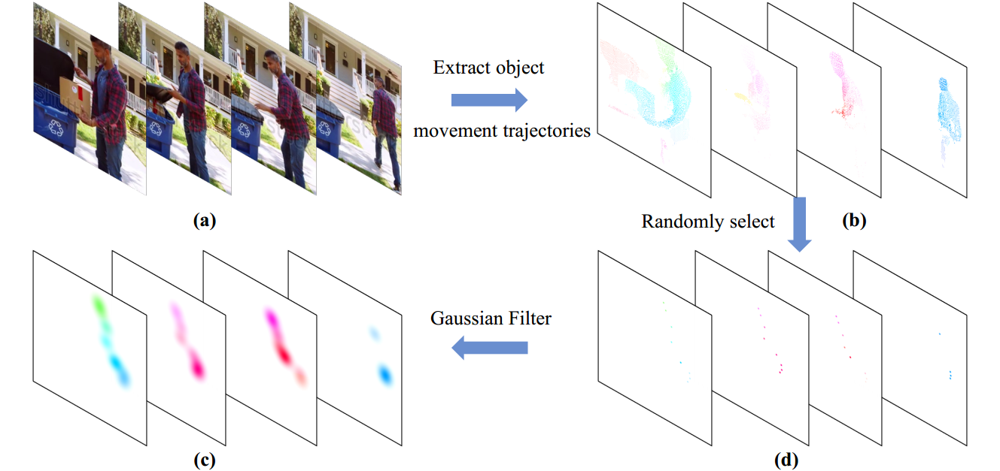
        
        - 为了避免用户需要提供上图b那样的密集轨迹，MotionCtrl要能够接收用户输入的稀疏轨迹来控制移动物体。因此，OMCM是通过从密集轨迹中随机选择n个轨迹来训练的（上图c）。然而，这些选择的稀疏轨迹往往过于分散，不利于有效的训练。从DragNUWA中获得启发，我们通过对稀疏轨迹应用高斯滤波器来缓解这个问题（上图d），我们最初使用密集轨迹训练OMCM，然后使用稀疏轨迹对其进行微调。

    - 训练OMCM时，LVDM和CMCM都是冻结的。这种策略保证了OMCM在有限的数据集上增加了对象运动控制功能，同时对LVDM和CMCM的影响最小。

# 4. 实验

## 4.1 实验设置
### 4.1.1 实现细节

- MotionCtrl建立在LVDM框架和VideoCrafter1之上，使用16帧的序列，256*256分辨率进行训练。
- 它可以很容易地适应其他具有类似结构的视频生成模型，如AnimateDiff。
- 轨迹的最大数目为8, batch=128，8个NVIDIA Tesla V100 GPU
- CMCM需要50000次迭代
- OMCM在密集轨迹上训练了20000次迭代，然后在稀疏轨迹上微调了20000次迭代

### 4.1.2 评估数据集
- 相机运动控制评估（407个样本）：包含两种类型的相机姿态：
        - 基本姿态（8*10个样本）：向左、向右、向上、向下、放大、缩小、逆时针旋转和顺时钟旋转（以及10个prompts）
        - 相对复杂相机姿态（RealEstate10K测试机中20个相对复杂的相机姿态序列和10个提示词得到200个样本）：基本的相机姿势包括在单一的直线方向上的运动，复杂的相机姿势包含在几个方向上的运动。
        - 这些姿态来自Realestate10K的测试集，或使用ParticleSfM在WebVid和HD-VILA的视频上合成（使用ParticleSfM合成的WebVid100个相对复杂的相机姿势，来自VBench的100个提示词，使用ParticleSfM合成的HD-VILA27个相对复杂的相机姿势，来自VBench的27个提示词）

- 物体运动控制评估：由283个样本组成，这些样本由各种手工制作的轨迹和提示词组成。包含74个轨迹和77个提示词。

### 4.1.3 评估指标
#### 1）生成视频质量评估
- FID: 视觉质量，参考视频来自WebVid的1000个视频

- FVD：时间一致性，参考视频来自WebVid的1000个视频

- CLIPSIM：文本相似度

#### 2）运动控制评估
- 通过计算预测的和真实的相机姿态/物体轨迹之间的欧式距离

    - 用ParticleSfM提取预测视频的相机姿态和物体轨迹
    - 将这两个指标命名为：CamMC和ObjMC

#### 3）user study

## 4.2 与sota方法相比

- AnimateDiff使用8个独立的LoRA模型来控制视频中的8个基本摄像机运动，例如平移和缩放

- VideoComposer使用运动矢量来操纵视频运动，而不区分摄像机和物体的运动。

### 4.2.1 相机运动控制

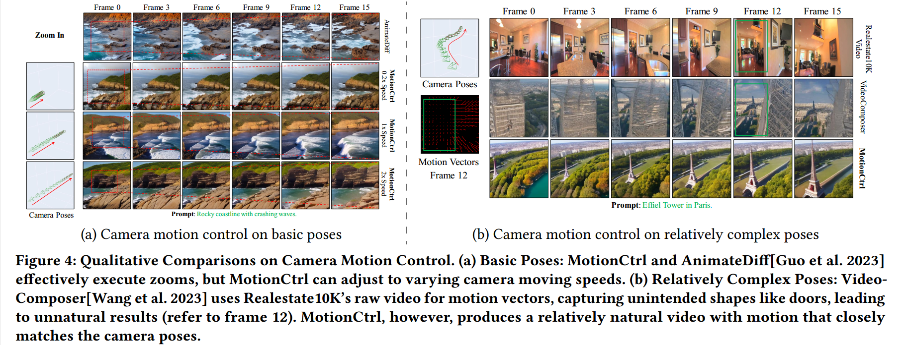

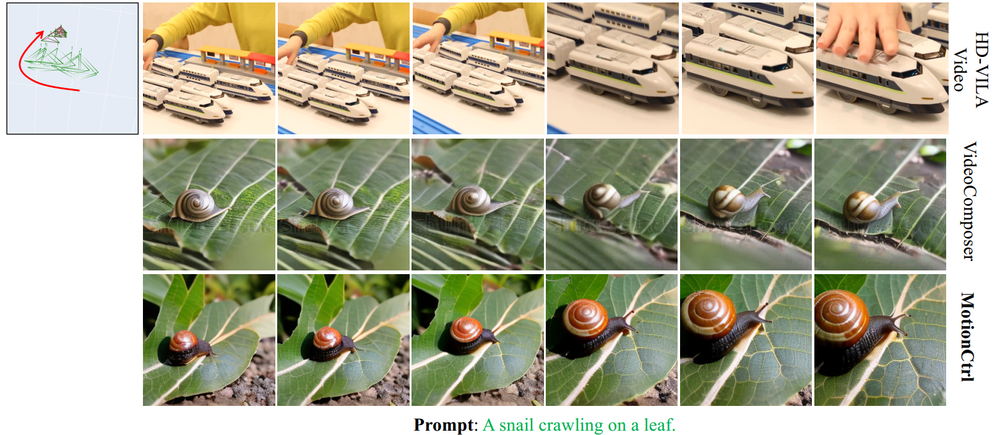

- 对于基本姿势，MotionCtrl可以生成不同速度的相机运动，而AnimaDiff时不可调的

- 对于复杂姿势：相机先向左前移动，然后向前移动。VideoComposer可以使用提取的运动向量来模拟参考视频的摄像机运动。然而，密集的运动向量无意中捕捉到了物体的形状，即参考视频（第12帧）中门的轮廓，从而产生了一个看起来不自然的埃菲尔铁塔。
> 你训练不也用了密集的运动向量？

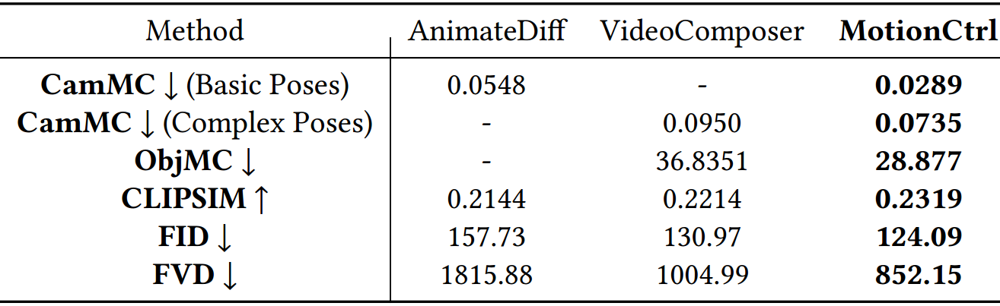

- 定量结果更好

### 4.2.2 物体运动控制

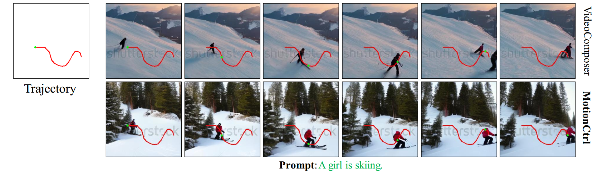

- 红色曲线表示给定的轨迹，而绿色点表示相应帧中预期的物体位置。MotionCtrl可以生成运动更接近给定轨迹的对象，而VideoComposer的结果在某些帧中偏离

### 4.2.3 相机运动与物体运动结合

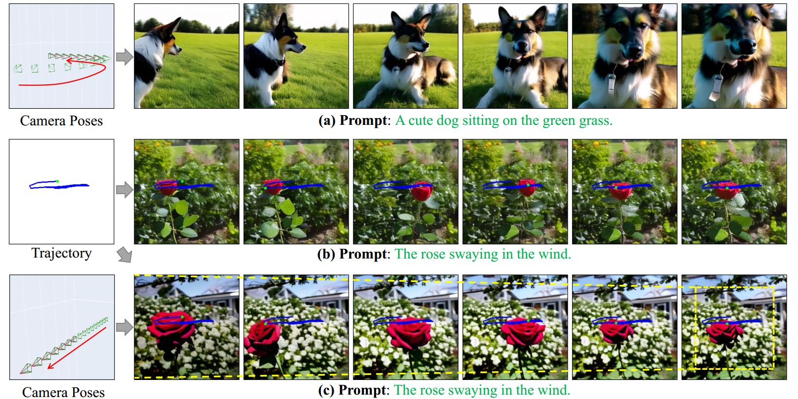

- 当MotionCtrl仅应用于轨迹时，它主要生成沿此路径的摇摆玫瑰。通过进一步引入缩放相机姿势，玫瑰和背景都按照指定的轨迹和相机运动进行动画。

## 4.3 Ablation Study

### 4.3.1 CMCM模块集成的位置

- 将CMCM集成到LVDM的不同位置：
    - 将相机姿势和time embedding模块结合
    - 将相机姿势和spatial cross-attention模块结合
    - 将相机姿势和spatial self-attention模块结合

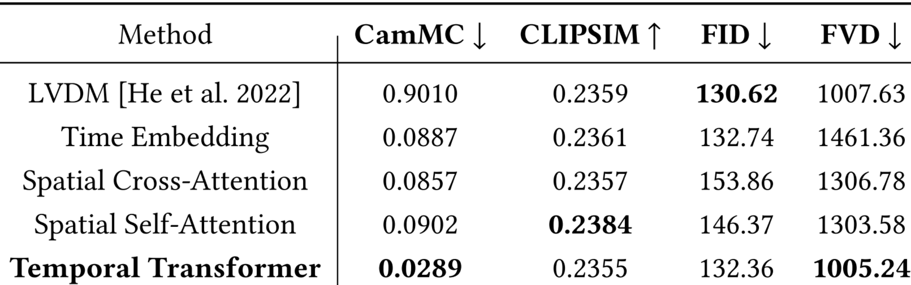

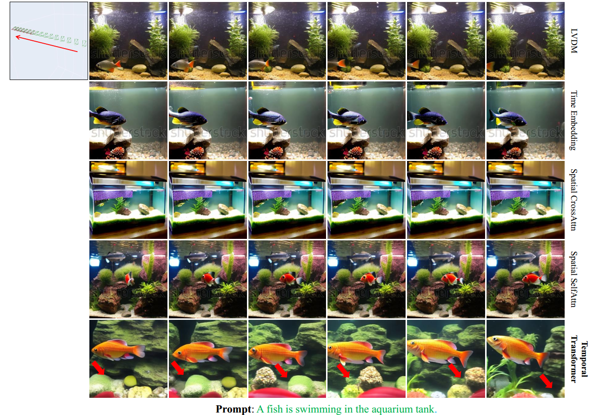

- 这三种位置得到的结果在CamMC上与最初的LVDM接近。这是因为这些组件主要关注空间内容生成，这对相机姿势中编码的相机运动不敏感。相反，将CMCM与LVDM的时间转换器结合，可以显著改善摄像机的运动控制。

### 4.3.2 密集轨迹和稀疏轨迹

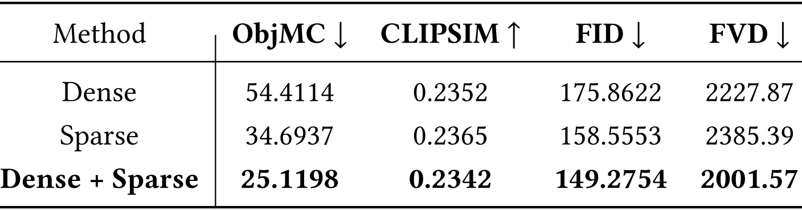

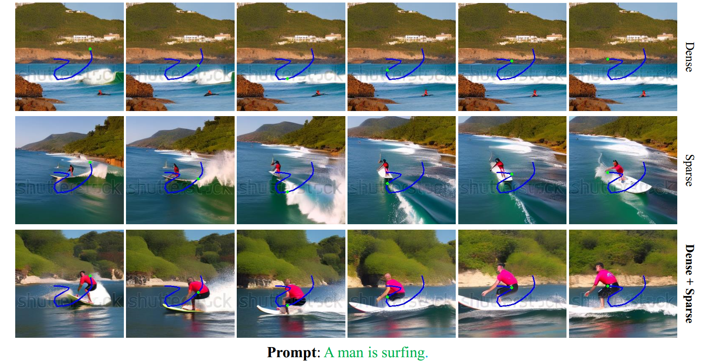

- 只使用密集轨迹的训练会产生较差的结果，**这是由于训练和推理阶段之间的差异（推理期间提供稀疏轨迹）。**

- 尽管仅使用稀疏轨迹进行训练比仅使用密集方法有所改进，但它仍然不如混合方法，**因为仅使用稀疏轨迹提供的信息有限。**

### 4.3.3 训练策略

- 先训OMCM，后训CMCM：由于CMCM的后续训练调整了LVDM的部分时间变压器，导致了物体运动控制性能的下降，破坏了OMCM初始训练时实现的物体运动控制适应。