#

<!--more-->

- arxiv v1: 2023/3

- ICCV 2023
- [论文地址](https://openaccess.thecvf.com/content/ICCV2023/html/Khachatryan_Text2Video-Zero_Text-to-Image_Diffusion_Models_are_Zero-Shot_Video_Generators_ICCV_2023_paper.html)

- [项目地址](https://github.com/Picsart-AI-Research/Text2Video-Zero)

# 0. Abstract

最近的文本到视频生成方法依赖于计算量大的训练，并且需要大规模的视频数据集。在本文中，我们引入了一项新任务，**零镜头文本到视频生成**，并通过利用现有文本到图像合成方法（例如稳定扩散）的能力，提出了一种低成本的方法（无需任何训练或优化），使其适用于视频领域。我们的关键修改包括**（i）用运动动态（motion dynamics）丰富生成帧的潜在代码，以保持全局场景和背景时间一致**；以及**(ii)通过使用每一帧相对于第一帧的新跨帧注意力，对帧级自注意力进行重编程，以保留前景物体的上下文、外观和身份。**实验表明，这导致低开销，但高质量和非常一致的视频生成。此外，我们的方法不限于文本到视频合成，还适用于其他任务，例如条件和内容专用视频生成，以及视频指令-Pix2Pix，即指令引导的视频剪辑。实验表明，尽管没有在额外的视频数据上进行训练，但我们的方法的性能与最近的方法相当，有时甚至更好。

# 1. Introduction

- TAV 还是需要一个优化的过程。此外，Tune-A-Video的生成能力仅限于文本引导的视频编辑应用；然而，从头开始的视频合成仍然遥不可及。

- 贡献：
  - 零镜头文本到视频合成的新问题设置，旨在让文本引导的视频生成和编辑“自由买得起”。我们只使用预训练的文本到图像扩散模型，没有任何进一步的微调或优化。
  - 两种新的事后技术，通过在潜在代码中编码运动动态，以及使用新的跨帧注意力重新编程每个帧的自我注意力，来实施时间一致的生成。
  - 展示我们方法有效性的各种应用，包括条件和专用视频生成，以及视频指令-Pix2Pix，即通过文本指令进行视频编辑。

# 2. Relate Work

## 2.1 文生图

## 2.2 文生视频

# 3. Method

## 3.1 Stable Diffusion

## 3.2 Zero-Shot Text-to-Video Problem Formulation

- 给定文本$\tau$，帧数$m \in \mathbb N$
- 需要设计一个函数$\mathcal F$，它能够输出一个视频$\mathcal V \in \mathbb R ^ { m \times H \times W \times 3}$

## 3.3 Method

### 3.3.1 Latent Codes中的Motion Dynamics

- 对于起始状态：$x_T ^ { 1:m}$，并不是每一帧都随机采样。而是采用如下算法

  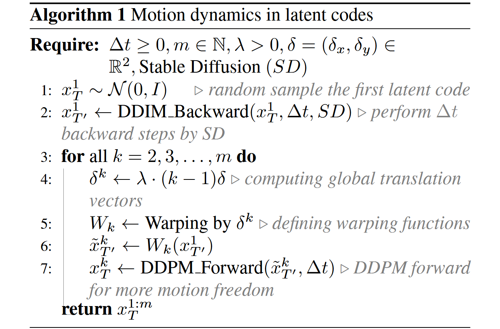

  

  1. 随机采样第一帧$x_T ^1 \sim \mathcal N( 0, 1)$

  2. 对第一帧$x_T ^ 1$使用DDIM推理$\Delta t$步，得到$X^ 1 _ { T ’ }$ 

  3. 为全局场景和摄像机运动定义一个方向$\delta = ( \delta_ x, \delta_ y \in \mathbb R^ 2)$ ，默认情况下可以是主对角线方向：$\delta = (1,1)$
     $$
     \left [ \begin{matrix}\delta^1 \\ \left [ \begin{matrix}
     0,0\\
     0,0
     \end{matrix} \right ] \\
     \left [ \begin{matrix}
     0,0\\
     0,0
     \end{matrix} \right ] \end{matrix} \right ] 
     
     \left [ \begin{matrix} \delta^2 \\ \left [ \begin{matrix}
     12 ,12\\
     12 ,12
     \end{matrix} \right ] \\
     \left [ \begin{matrix}
     12,12\\
     12,12
     \end{matrix} \right ] \end{matrix} \right ] 
     
     \left [  \begin{matrix} \delta^3 \\ \left [ \begin{matrix}
     24,24\\
     24,24
     \end{matrix} \right ] \\
     \left [ \begin{matrix}
     24,24\\
     24,24
     \end{matrix} \right ]  \end{matrix} \right ]
     $$
     
4. 对于我们要生成的每个帧$k=1, 2, ... , m$，计算全局平移向量$\delta^ k = \lambda \cdot（k-1）\delta $，其中$\lambda$是控制全局运动量的超参数。
  
5. 将你构造的运动流$\delta ^ { 1:m }$应用于$x^ 1 _ {T’}$，得到结果序列：
     $$
     \tilde x ^ k _{ T' } = W_ k (x ^ 1 _{ T' }) \space \space \space for \space k=1,2, \dots,m
     $$
  
   - 其中$W_ k(x^ 1 _ { T ^ \prime})$是用向量$\delta^ k$进行转换的翘曲操作。详细信息参见 
  
6. 对每个$\tilde x ^ k _{ T' }$执行$\Delta t$次DDPM前向过程得到每一帧的初始噪声$x_T ^ {2:m}$
  
- 然而，这种对$X_ T$的约束不足以描述特定的颜色、身份或形状，因此仍然导致时间不一致，尤其是对于前景对象。

### 3.3.2 跨帧注意力

- 为了解决上述问题，我们使用跨帧注意力机制来在整个生成的视频中保留关于（特别是）前景对象的外观、形状和身份的信息。

$$
\begin{aligned}
\text{ Cross-Frame-Attn }(Q^k, K^ { 1:m },V^{ 1: m } ) & = \\ Softmax \left( \frac{ Q^ k( K ^ 1 ) ^ T }{ \sqrt { c }} \right) V ^ 1
\end{aligned}
$$

### 3.3.3 背景平滑（可选）

- 我们使用第一帧和帧k之间的`background-masked latent codes`的**凸组合**来进一步改善背景的时间一致性。当提供一个或没有初始图像并且没有提供进一步的指导时，这尤其有助于从文本提示生成视频。
- 更详细地，给定我们的视频生成器的生成序列$x^ { 1 : m }_ 0$，我们应用（一个内部解决方案）显著对象检测到解码图像，以获得每个帧k的相应前景掩模$M ^ k$。然后，我们根据$W_k$定义的motion dynamics扭曲$x^ 1 _ t$，并用$\hat x_ t ^ k := W_ k(x^ 1_  t)$表示结果。
- 背景平滑是通过背景上的实际潜在编码$x_ t^ k$和翘曲潜在编码$\hat x _ t ^ k$之间的凸组合来实现的：

    $$
    \bar x_ t ^ k = M^ k \odot x_ t ^ k + (1-M^ k ) \odot ( \alpha \hat x _t^ k + (1-\alpha) x_ t ^ k )
    $$

	- 其中$\alpha$是一个超参数，本文取0.6

- 最后对$\bar x_ t ^ k$使用DDIM采样，它提供了具有背景平滑的视频生成。当**没有提供指导时**，我们在从文本生成视频时使用背景平滑。

## 3.4 条件化和专用化的T2V

- ControlNet能够使用边缘、姿态、语义掩码、图像深度等来调节生成过程。然而，ControlNet在视频领域的**直接应用**会导致时间不一致以及对象外观、身份和背景的严重变化。事实证明，我们对视频基本扩散过程的修改导致了由ControlNet条件引导的更一致的视频。

- 更具体地说，ControlNet创建UNet 编码器（包括中间块）的可训练副本，同时额外获取输入$x_ t$和条件c，并将每一层的输出添加到原始UNet的skipconnections。这里c可以是任何类型的条件，例如边缘图、涂鸦、姿势（身体标志）、深度图、分割图等。针对每种类型的条件c，在特定域上训练可训练分支，从而产生有效的条件文本-图像生成机制。

- 为了使用ControlNet指导我们的视频生成过程，我们将我们的方法应用于基本的扩散过程，即**用运动信息丰富潜在码$x^ { 1:m } _ T$，**并在主UNet中将自注意力改变为**跨帧注意力**。在采用主UNet进行视频生成任务时，我们在每个$x_ t^ k,k=1, \cdots,m$上每帧应用ControlNet预训练的复制分支，在每个扩散时间步长t=t，...，1，并将ControlNet分支输出添加到主UNet的跳过连接。

- 此外，对于我们的条件生成任务，我们采用了专门的DreamBooth（DB）模型的权重。这为我们提供了专门的时间一致的视频生成（参见图7）。

## 3.5 Video Instruct-Pix2Pix

- 随着文本引导图像编辑方法的兴起，如Prompt2Prompt、Instruct-Pix2Pix、SDEdit等。出现了文本引导的视频编辑方法[1，16，42]。虽然这些方法需要复杂的优化过程，但我们的方法能够在视频领域采用任何基于SD的文本引导图像编辑算法，而无需任何训练或微调。这里**我们采用文本引导的图像编辑方法Instruct-Pix2Pix**，并将其与我们的方法相结合。更准确地说，我们将Instruct-Pix2Pix中的自我注意机制更改为交叉帧注意。我们的实验表明，与使用Instruct-Pix2Pix的näive每帧相比，这种适应显著提高了编辑视频的一致性（见图9）。

# 4. 实验

## 4.1 实验细节

- SD 1.5
- 生成8帧
- 分辨率512
- 对于文生图T' = 881，T=941
- 对于条件生成和specialized generation以及Video Instruct-Pix2Pix，T'=T=1000

- specialized model使用dream booth
- conditional generation使用controlnet
- video Instruct-Pix2Pix使用 Instruct Pix2Pix

## 4.2 定性结果

- Text2Video-Zero的所有应用都表明，它成功地生成了全局场景和背景在时间上一致的视频，并且在整个序列中保持了前景对象的上下文、外观和身份。

- 对于文生视频，生成了高质量视频，与文本高度对齐。

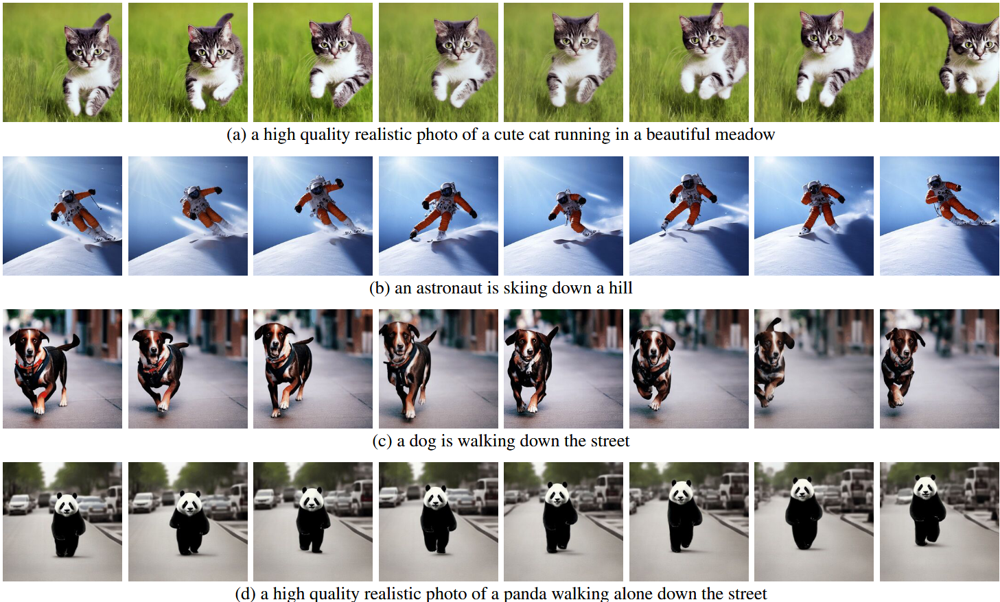

- 使用边缘或姿势生成与提示词和指导相匹配的高质量视频，显示出很好的时间一致性和身份保留。

  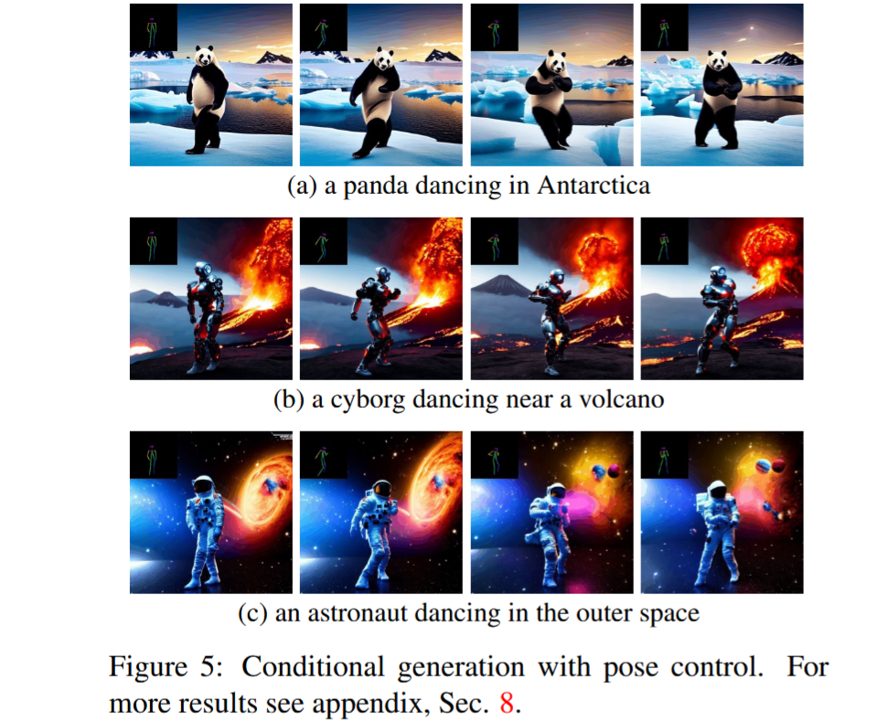

  

  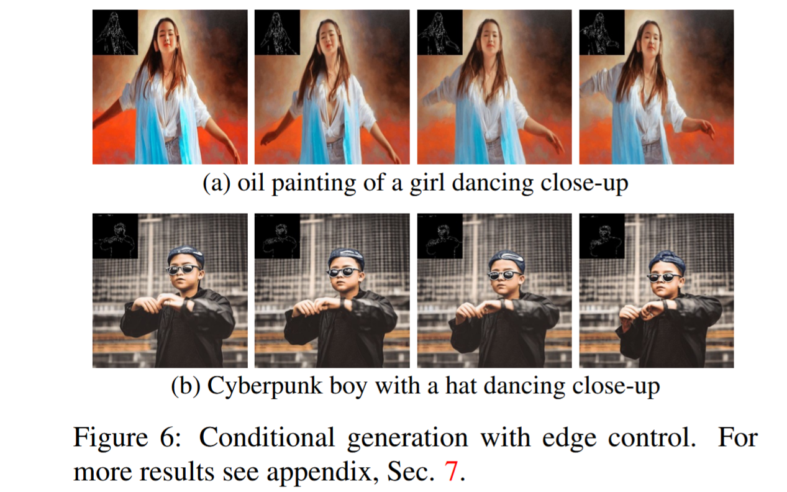

  

  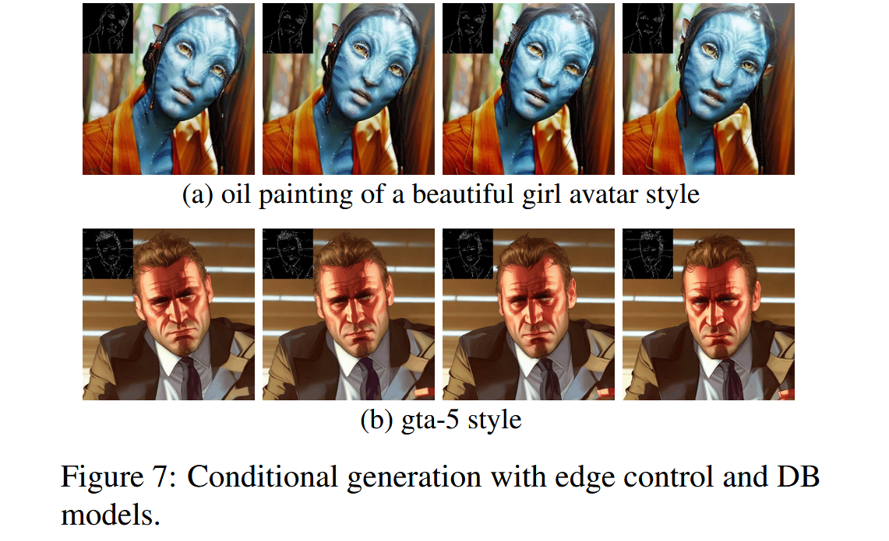

  

- VIdeo Instruct-Pix2Pix

  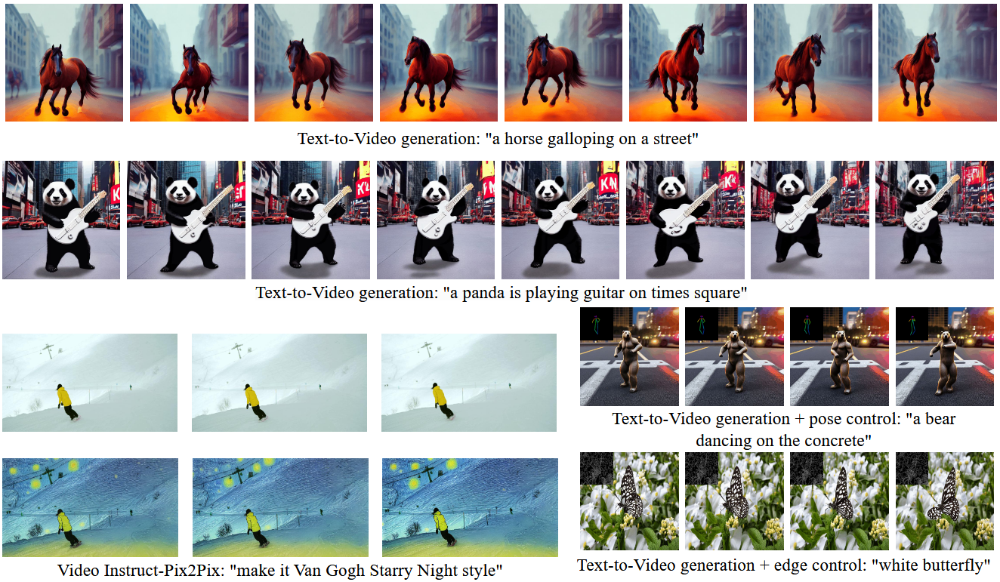

  

## 4.3 与baseline比较

- CogVideo比较文生视频
- TAV比较 Video Instruct-Pix2Pix

### 4.3.1 定量比较

- CLIP score
- 随机选取25个生成的视频（同一提示词）

| 模型            | CLIP Score |
| --------------- | ---------- |
| CogVideo        | 29.63      |
| Text2Video-zero | 31.19      |

- 因此，我们的方法略微优于CogVideo，尽管后者有94亿个参数，并且需要对视频进行大规模训练。

### 4.3.2 定性比较

- CogVIdeo和本文方法都有较好的时间一致性，保留了对象和背景的身份。然而，我们的方法显示了更好的**文本-视频对齐**

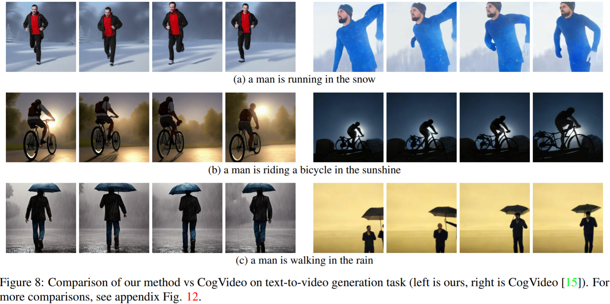

- 逐帧Instruct-Pix2Pix显示了良好的每帧编辑性能，它**缺乏时间一致性**。这一点在描绘滑雪者的视频中变得尤为明显，其中雪和天空是用不同的风格和颜色绘制的。

- 使用我们的视频指令-Pix2Pix方法，这些问题得到了解决，从而在整个序列中实现了时间上一致的视频编辑。

- 虽然Tune-A-Video创建了时间上一致的视频生成，但它**不如我们的方法与指令指导一致**，难以创建local编辑并丢失了输入序列的细节。当查看图9(左侧)中描绘的舞者视频的编辑时，这变得显而易见。与Tune-A-Video相比，**我们的方法将整件衣服画得更亮，同时更好地保留了背景**，例如，舞者后面的墙几乎保持不变。**Tune-A-Video绘制了一堵经过严重修改的墙**。此外，我们的方法更忠实于输入细节，例如，视频Instruct-Pix2Pix使用完全提供的姿势绘制舞者（图9左），并显示输入视频中出现的所有滑雪者（比较图9的最后一帧（右）），与Tune-A-Video相反。在附录图23、24中提供的附加评估中也可以观察到Tune-A-Video的所有上述弱点。

  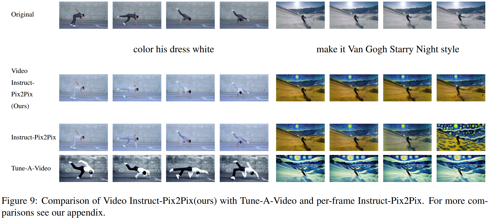

  

## 4.4 Ablation

- 使用基本模型，即没有我们的更改（第一行），无法实现时间一致性。这对于不受约束的文本到视频生成尤其严重。例如，马的外观和位置变化非常快，背景完全不一致。

- 使用我们提出的运动动力学（第二行），视频的一般概念在整个序列中被更好地保留。例如，所有帧都显示了一匹运动中的马的特写。同样，中间四个图形中的女人和背景的外观（使用带边缘引导的ControlNet）大大提高了。

- 使用我们提出的跨帧注意力（第三行），我们看到在所有生成帧中，对象身份及其外观的保存都得到了改善。

- 最后，通过结合这两个概念（最后一行），我们实现了最佳的时间一致性。例如，我们在最后四列中看到相同的背景图案和关于对象身份保存的信息，同时在生成的图像之间看到自然过渡。

  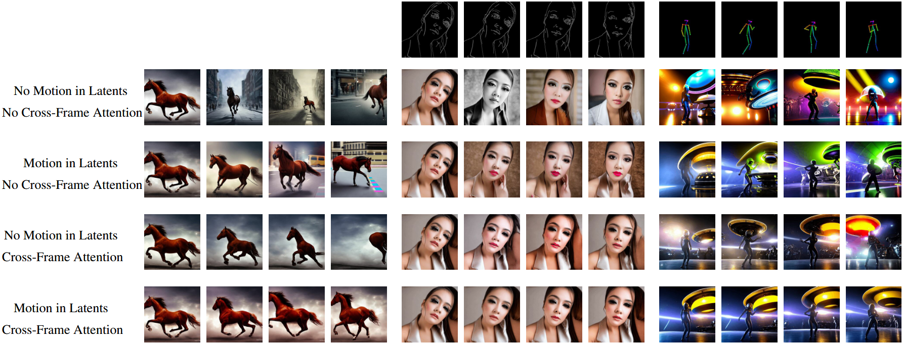

  

### 4.4.1 其他Ablation

- 对$\Delta t$=0时（对$x_T$施加运动）主要导致全局移位，而没有任何单个物体运动。

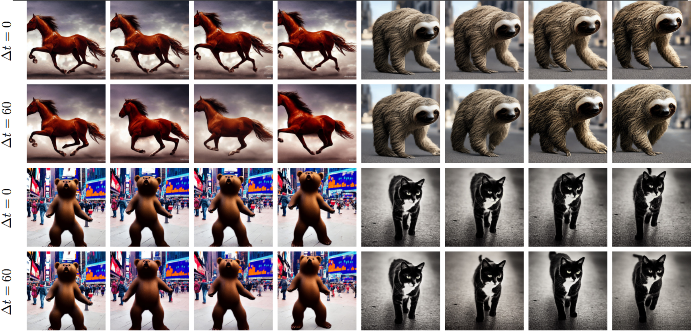

- 背景更一致，保持的更好（红色广告牌）

  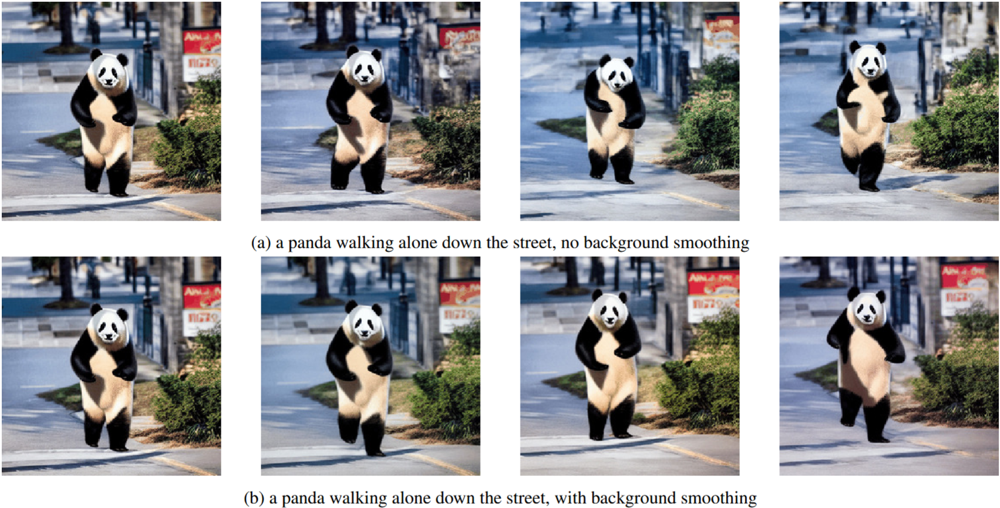

  

- 边缘图条件生成：当使用CF-Attn层时，生成更好地保留了人的身份，并且在潜在中使用运动进一步提高了时间一致性。

  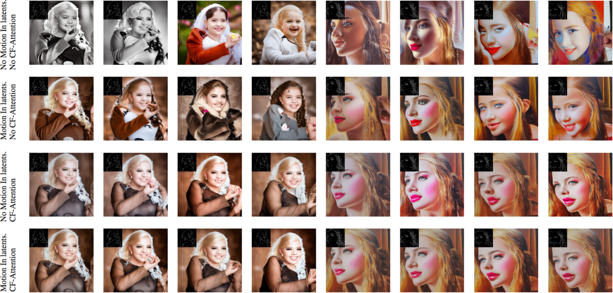

  

- Video Instruct-Pix2Pix生成: 虽然在语义上知道文本引导编辑，但Tune-A-Video在本地化编辑方面有局限性，并且难以传输样式和颜色信息。另一方面，Instruct-Pix2Pix在图像级别进行视觉上合理的编辑，但在时间一致性方面存在问题。与上述方法相比，我们的方法在通过给定提示编辑视频时保持了时间一致性。

  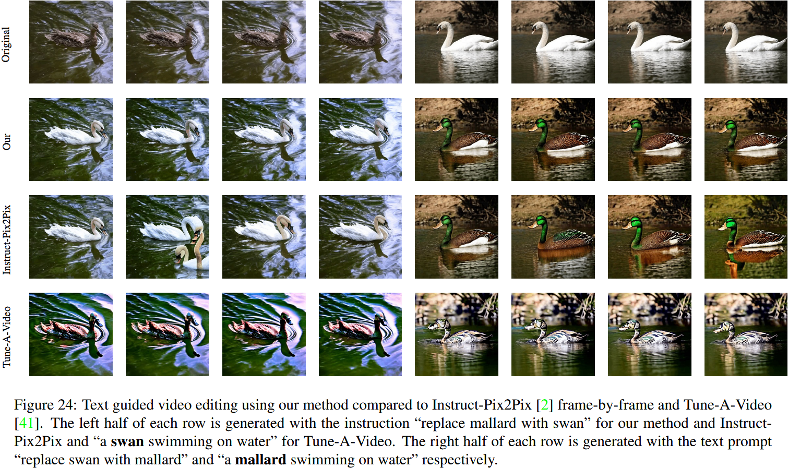

  