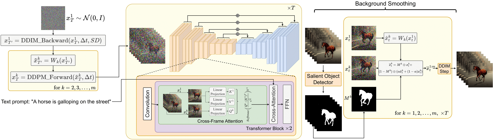

#

<!--more-->

- ICCV 2023
- [论文地址](https://openaccess.thecvf.com/content/ICCV2023/html/Khachatryan_Text2Video-Zero_Text-to-Image_Diffusion_Models_are_Zero-Shot_Video_Generators_ICCV_2023_paper.html)

- [项目地址](https://github.com/Picsart-AI-Research/Text2Video-Zero)

# 0. Abstract

最近的文本到视频生成方法依赖于计算量大的训练，并且需要大规模的视频数据集。在本文中，我们引入了一项新任务，**零镜头文本到视频生成**，并通过利用现有文本到图像合成方法（例如稳定扩散）的能力，提出了一种低成本的方法（无需任何训练或优化），使其适用于视频领域。我们的关键修改包括**（i）用运动动态（motion dynamics）丰富生成帧的潜在代码，以保持全局场景和背景时间一致**；以及**(ii)通过使用每一帧相对于第一帧的新跨帧注意力，对帧级自注意力进行重编程，以保留前景物体的上下文、外观和身份。**实验表明，这导致低开销，但高质量和非常一致的视频生成。此外，我们的方法不限于文本到视频合成，还适用于其他任务，例如条件和内容专用视频生成，以及视频指令-Pix2Pix，即指令引导的视频剪辑。实验表明，尽管没有在额外的视频数据上进行训练，但我们的方法的性能与最近的方法相当，有时甚至更好。

# 1. Introduction

- TAV 还是需要一个优化的过程。此外，Tune-A-Video的生成能力仅限于文本引导的视频编辑应用；然而，从头开始的视频合成仍然遥不可及。

- 贡献：
  - 零镜头文本到视频合成的新问题设置，旨在让文本引导的视频生成和编辑“自由买得起”。我们只使用预训练的文本到图像扩散模型，没有任何进一步的微调或优化。
  - 两种新的事后技术，通过在潜在代码中编码运动动态，以及使用新的跨帧注意力重新编程每个帧的自我注意力，来实施时间一致的生成。
  - 展示我们方法有效性的各种应用，包括条件和专用视频生成，以及视频指令-Pix2Pix，即通过文本指令进行视频编辑。

# 2. Relate Work

## 2.1 文生图

## 2.2 文生视频

# 3. Method

## 3.1 Stable Diffusion

## 3.2 Zero-Shot Text-to-Video Problem Formulation

- 给定文本$\tau$，帧数$m \in \mathbb N$
- 需要设计一个函数$\mathcal F$，它能够输出一个视频$\mathcal V \in \mathbb R ^ { m \times H \times W \times 3}$

## 3.3 Method

### 3.3.1 Latent Codes中的Motion Dynamics

- 对于起始状态：$x_T ^ { 1:m}$，并不是每一帧都随机采样。而是采用如下算法

  

  

  1. 随机采样第一帧$x_T ^1 \sim \mathcal N( 0, 1)$

  2. 对第一帧$x_T ^ 1$使用DDIM推理$\Delta t$步，得到$X^ 1 _ { T ’ }$ 

  3. 为全局场景和摄像机运动定义一个方向$\delta = ( \delta_ x, \delta_ y \in \mathbb R^ 2)$ ，默认情况下可以是主对角线方向：$\delta = (1,1)$

  4. 对于我们要生成的每个帧$k=1, 2, ... , m$，计算全局平移向量$\delta^ k = \lambda \cdot（k-1）\delta $，其中$\lambda$是控制全局运动量的超参数。

  5. 将你构造的运动流$\delta ^ { 1:m }$应用于$x^ 1 _ {T’}$，得到结果序列：
     $$
     \tilde x ^ k _{ T' } = W_ k (x ^ 1 _{ T' }) \space \space \space for \space k=1,2, \dots,m
     $$

     - 其中$W_ k(x^ 1 _ { T ^ \prime})$是用向量$\delta^ k$进行转换的翘曲操作。

  6. 对每个$\tilde x ^ k _{ T' }$执行$\Delta t$次DDPM前向过程得到每一帧的初始噪声$x_T ^ {2:m}$

- 然而，这种对$X_ T$的约束不足以描述特定的颜色、身份或形状，因此仍然导致时间不一致，尤其是对于前景对象。

### 3.3.2 跨帧注意力

- 为了解决上述问题，我们使用跨帧注意力机制来在整个生成的视频中保留关于（特别是）前景对象的外观、形状和身份的信息。

$$
\begin{aligned}
\text{ Cross-Frame-Attn }(Q^k, K^ { 1:m },V^{ 1: m } ) & = \\ Softmax \left( \frac{ Q^ k( K ^ 1 ) ^ T }{ \sqrt { c }} \right) V ^ 1
\end{aligned}
$$

### 3.3.3 背景平滑（可选）

- 我们使用第一帧和帧k之间的`background-masked latent codes`的**凸组合**来进一步改善背景的时间一致性。当提供一个或没有初始图像并且没有提供进一步的指导时，这尤其有助于从文本提示生成视频。
- 更详细地，给定我们的视频生成器的生成序列$x^ { 1 : m }_ 0$，我们应用（一个内部解决方案）显著对象检测到解码图像，以获得每个帧k的相应前景掩模$M ^ k$。然后，我们根据$W_k$定义的motion dynamics扭曲$x^ 1 _ t$，并用$\hat x_ t ^ k := W_ k(x^ 1_  t)$表示结果。
- 背景平滑是通过背景上的实际潜在编码$x_ t^ k$和翘曲潜在编码$\hat x _ t ^ k$之间的凸组合来实现的：

    $$
    \bar x_ t ^ k = M^ k \odot x_ t ^ k + (1-M^ k ) \odot ( \alpha \hat x _t^ k + (1-\alpha) x_ t ^ k )
    $$

	- 其中$\alpha$是一个超参数，本文取0.6

- 最后对$\bar x_ t ^ k$使用DDIM采样，它提供了具有背景平滑的视频生成。当**没有提供指导时**，我们在从文本生成视频时使用背景平滑。

## 3.4 条件化和专用化的T2V

- ControlNet能够使用边缘、姿态、语义掩码、图像深度等来调节生成过程。然而，ControlNet在视频领域的**直接应用**会导致时间不一致以及对象外观、身份和背景的严重变化。事实证明，我们对视频基本扩散过程的修改导致了由ControlNet条件引导的更一致的视频。

- 更具体地说，ControlNet创建UNet 编码器（包括中间块）的可训练副本，同时额外获取输入$x_ t$和条件c，并将每一层的输出添加到原始UNet的skipconnections。这里c可以是任何类型的条件，例如边缘图、涂鸦、姿势（身体标志）、深度图、分割图等。针对每种类型的条件c，在特定域上训练可训练分支，从而产生有效的条件文本-图像生成机制。

- 为了使用ControlNet指导我们的视频生成过程，我们将我们的方法应用于基本的扩散过程，即用运动信息丰富潜在码$x^ { 1:m } _ T$，并在主UNet中将自注意力改变为跨帧注意力。在采用主UNet进行视频生成任务时，我们在每个$x_ t^ k,k=1, \cdots,m$上每帧应用ControlNet预训练的复制分支，在每个扩散时间步长t=t，...，1，并将ControlNet分支输出添加到主UNet的跳过连接。

- 此外，对于我们的条件生成任务，我们采用了专门的DreamBooth（DB）模型的权重。这为我们提供了专门的时间一致的视频生成（参见图7）。

## 3.5 Video Instruct-Pix2Pix

- 随着文本引导图像编辑方法的兴起，如Prompt2Prompt、Instruct-Pix2Pix、SDEdit等。出现了文本引导的视频编辑方法[1，16，42]。虽然这些方法需要复杂的优化过程，但我们的方法能够在视频领域采用任何基于SD的文本引导图像编辑算法，而无需任何训练或微调。这里**我们采用文本引导的图像编辑方法Instruct-Pix2Pix**，并将其与我们的方法相结合。更准确地说，我们根据等式将Instruct-Pix2Pix中的自我注意机制更改为交叉帧注意。8.我们的实验表明，与使用Instruct-Pix2Pix的näive每帧相比，这种适应显著提高了编辑视频的一致性（见图9）。