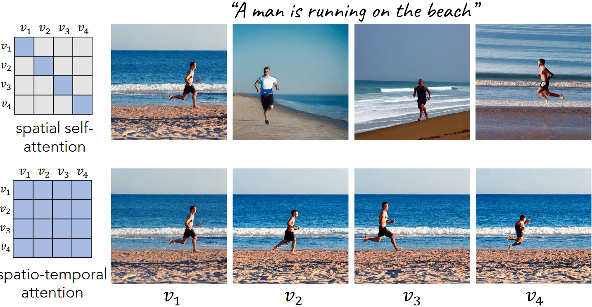
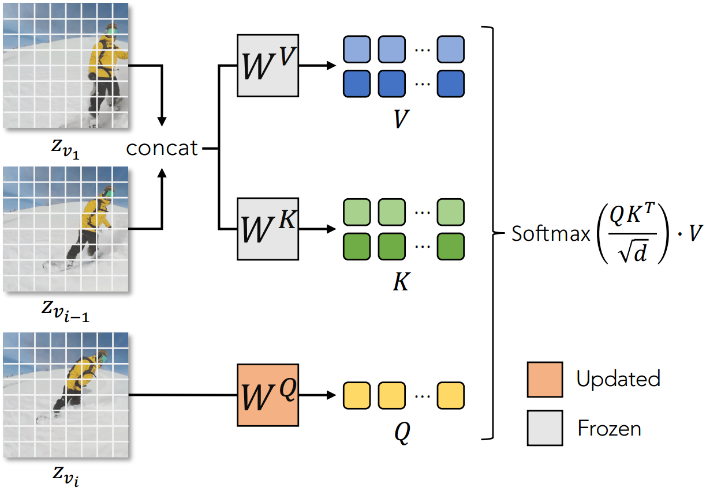
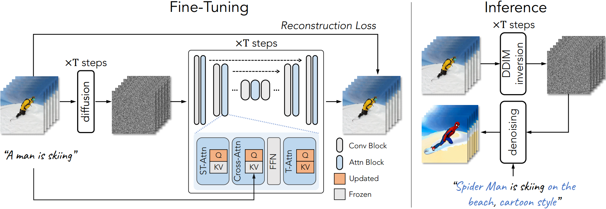
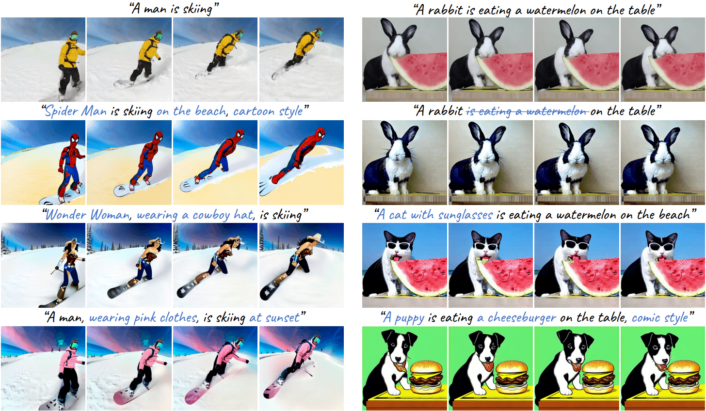
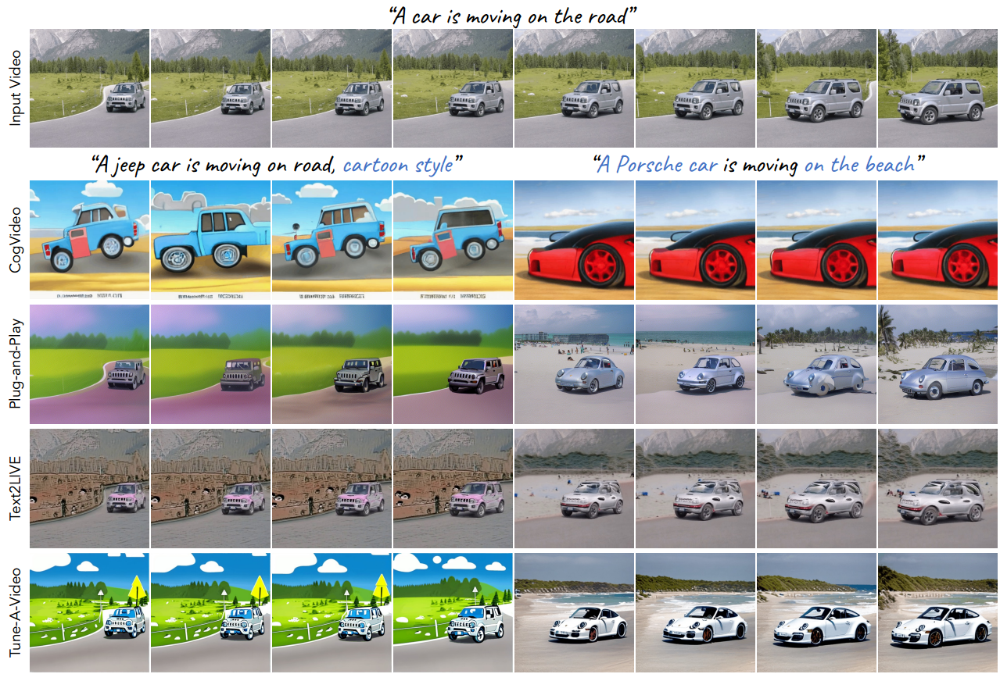
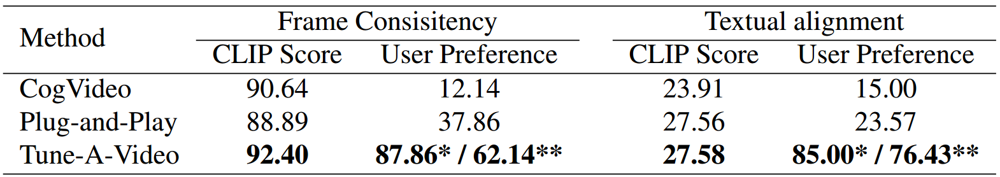

#

<!--more-->

- ICCV 2023
- [论文地址](https://arxiv.org/abs/2212.11565)
- [项目地址](https://github.com/showlab/Tune-A-Video)

https://blog.csdn.net/wjpwjpwjp0831/article/details/141862947

# 0. Abstract

1. 背景：
   - 为了复制文生图（T2I）的成功，近年来的研究利用**大规模视频数据集**训练文本到视频（T2V）生成器。尽管它们的结果令人振奋，但这种范式在**计算上是昂贵**的。
2. 本文内容：
   - 提出了一种新的T2V生成设置——**单次视频调优**（One-Shot Video Tuning），其中**仅提供一对文本-视频**。本文模型建立在预训练T2I扩散模型之上。
   - 我们做出了两个关键观察：
     1. T2I模型可以生成**代表动词术语**（verb terms）的**静态图像**；
     2. 扩展T2I模型以生成多个图像展现出令人惊讶的**内容一致性**。
   - **为了进一步学习连续运动**，我们引入了Tune-A-Video，这涉及到一个量身定制的**时空注意机制**和一个高效的**一次性调优策略**（one-shot tuning strategy）。
   - 在推理过程中，我们采用**DDIM反演**为采样提供结构指导。

# 1. Introduction

背景&#9660;
<li>大规模多模态数据集[41]，由从互联网爬取的数十亿对文本-图像组成，已实现文本到图像（T2I）生成的突破[30, 35, 6, 42, 40]。为了在文本到视频（T2V）生成中复制这一成功，近期的研究[42, 15, 18, 53, 47]<b>将仅限空间的T2I生成模型扩展到时空域</b>。这些模型通常采用在大规模文本-视频数据集（例如WebVid-10M [2]）上训练的标准范式。尽管这一范式在T2V生成方面产生了令人鼓舞的结果，但它需要在大型硬件加速器上进行广泛的训练，这既昂贵又耗时。</li>

问题引入&#9660;
<li>人类拥有通过利用现有知识和所提供信息创造新概念、想法或事物的能力。例如，当我们看到一个文本描述为“一个人在雪上滑雪”的视频时，我们可以想象一只熊猫在雪上滑雪，基于我们对熊猫外貌的知识。由于经过大规模图像-文本数据预训练的T2I模型已经捕捉了开放域概念的知识，因而产生了一个直观的问题：它们能否像人类一样<b>从一个视频示例推断出其他新的视频？</b></li>
    <li>因此，引入了一种新的T2V生成设置，即一次性视频调优，其中<b>仅使用一对文本-视频进行T2V生成器的训练</b>。该生成器预期能够从输入视频中<b>捕捉基本运动信息</b>，并根据提示词合成新视频。</li>

- 成功的视频生成的关键在于**保持一致对象的连续运动**。因此，我们对最先进的文本到图像扩散模型（T2I扩散模型）进行以下观察，以此激励我们的方法：
  1. 关于运动：T2I模型能够生成与文本良好对齐的图像，包括动词术语。
     - 例如，给定文本提示“一个男人在海滩上跑”，T2I模型生成了一个男人在跑的快照（**而不是走或跳**），**尽管不一定是以连续的方式**（见图2的第一行）。这证明了T2I模型可以通过**跨模态注意力**正确关注动词以生成静态运动。
  2. 关于一致对象：简单地将T2I模型中的**空间自注意力**从一幅图像扩展到多幅图像，可以在帧之间产**生一致的内容**。以“一个男人正在海滩上跑步”为例，当空间自注意力扩展到时空注意力后生成的连续帧，尽管运动仍然不连续（见图2的第二行），但在生成的序列中可以观察到相同的人和相同的海滩。这表明**T2I模型中的自注意力层仅受到空间相似性的驱动，而非像素位置**。

- 我们将我们的发现实现为一种简单而有效的方法，称为Tune-A-Video。我们的方法基于对最先进的T2I模型**在时空维度上的简单扩展**。
  - 然而，在时空中使用**全面注意力**不可避免地会导致**计算的平方增长**。因此，生成具有很多帧数的视频是不可行的。
  - 此外，**更新所有参数**可能会**危及T2I模型已有的知识**，并阻碍含有新概念的视频的生成。
  - 为了解决这些问题，我们引入了一种**稀疏的时空注意力机制**，仅访问**第一帧**和**前一帧**，以及一种高效的调优策略，**仅更新注意力块中的投影矩阵**。
  - 经验上，这些设计**在所有帧间保持一致的目标**，但**缺乏连续的运动**。因此，在推理时，我们进一步通过<b>DDIM反演</b>从输入视频中寻求<b>结构指导</b>。以反演的潜变量作为初始噪声，我们生成了表现出<b>平滑运动的时间一致性视频</b>。值得注意的是，我们的方法与现有的个性化和条件预训练 T2I 模型（如 DreamBooth [39] 和 T2I-Adapter [29]）本质上兼容，提供个性化和可控的用户接口。

- 本文贡献：
  - 引入了一种用于T2V生成的一次性视频调优的新设置，减轻了使用大规模视频数据集进行训练的负担。
  - 提出了Tune-A-Video，这是第一个使用<b>预训练T2I模型</b>进行T2V生成的框架。
  - 提出<b>高效注意力调优</b>和<b>结构反转</b>，这显著提高了时间一致性。

# 2. Related Work

- 我们的工作位于几个领域的交汇点：
  - 基于diffusion的文生图与文生视频
  - 文本驱动的真实图像/视频编辑
  - 基于单个视频训练的生成模型

## 2.1 文生图diffusion模型

1. 基于transformer
2. 基于diffusion
   - GLIDE在扩散模型中提出无分类器引导以提高图像质量
   - DALLE-2使用 CLIP 特征空间改善文本-图像对齐
   - Imagen利用级联扩散模型进行高清晰度视频生成
   - VQdiffusion 和潜在扩散模型 (LDMs) 在自编码器的潜在空间中操作，以提高训练效率。我们的方法<b>基于 LDMs</b>，通过将二维模型扩展到潜在空间中的时空域。

## 2.2 文生视频模型

- 早期的研究主要集中于在<b>简单领域</b>生成视频，例如移动数字或特定的人类动作
  - GODIVA是第一个利用 2D VQ-VAE 和稀疏注意力进行 T2V 生成的模型，这使得场景更加真实
  - N&#220;WA在此基础上扩展了 GODIVA，通过多任务学习方法提供了不同生成任务的统一表示
  - 为了进一步提高 T2V 生成性能，CogVideo通过在预训练的 T2I 模型 CogView2上添加额外的时间注意力模块进行开发。

- 为了复制 T2I 扩散模型的成功，视频扩散模型 (VDM) 使用了空间-时间分解的 U-Net，通过联合图像和视频数据进行训练。

- Imagen video通过<b>级联扩散模型</b>和<b> v-预测参数化</b>来改善 VDM，以生成高清晰度视频。

- Make-A-Video 和 MagicVideo 具有类似的动机，旨在将 T2I 生成的进展转移到 T2V 生成中。

   尽管当前的 T2V 生成模型已经显示出令人印象深刻的结果，但它们的成功在很大程度上依赖于使用大量视频数据进行训练。相反，我们提出了一种通过高效调整预训练的 T2I 扩散模型在一个文本-视频配对上进行 T2V 生成的新框架。

## 2.3 文本驱动的视频编辑

- 最近的基于扩散的图像编辑模型可以处理视频中的每一帧，但由于模型缺乏时间感知，这导致帧之间的一致性问题。

- Text2Live允许使用文本提示进行某种基于纹理的视频编辑，但由于依赖于分层神经图集 [20]，难以准确反映预期的编辑效果。此外，生成神经图集通常需要约10小时，而我们的方法每个视频仅需10分钟的训练，并且可以在1分钟内对视频进行采样。
- 两个并行的工作，Dreamix和 Gen-1，均利用视频扩散模型（VDM）进行视频编辑。尽管它们的结果令人印象深刻，但值得注意的是，VDM在计算上资源密集，并且需要大量标注的图像和视频进行训练。此外，它们的训练数据和预训练模型并不公开。

## 2.4 从单个视频生成

- 单视频 GAN生成<b>与输入视频具有相似外观和动态</b>的新视频。然而，这些基于 GAN 的方法在计算时间上受到限制（例如，HPVAE-GAN [12]需要 8 天来训练 13 帧的短视频），因此在某种程度上是不切实际且不可扩展的。
- 补丁最近邻方法[13]执行更高质量的视频生成，同时将计算费用减少几个数量级。然而，它们的泛化能力有限，因此<b>只能处理自然“复制”输入视频部分的任务</b>。
- 最近，SinFusion [31] 将扩散模型应用于单视频任务，并通过改进的运动泛化能力实现自回归视频生成；然而，它仍然无法制作包含新颖语义上下文的视频。

# 3. 方法

- 令$V = \{v_i \space | \space i\in [1，m] \}$是一个包含m帧的视频，$P$是描述$V$的提示词。
- 我们的目标是生成由<b>编辑文本提示</b>$P ^∗$驱动的新视频$V^ *$。
  - 例如，考虑一个视频（$V$）和源提示“男人在滑雪”（$P$），并假设用户想<i>改变衣服的颜色</i>，<i>将牛仔帽戴在滑雪者身上</i>，甚至<i>在保留蜘蛛侠的同时，将滑雪者替换为蜘蛛侠原始视频的运动</i>。用户可以通过进一步描述滑雪者的外观或用其他单词替换来修改源提示词
- 一种直观的解决方案是在大规模视频数据集上训练 T2V 模型，但其计算成本较高 [42,15,7]。在本文中，我们提出了一种名为 OneShot Video Tuning 的新设置，它使用公开可用的 T2I 模型和单个文本视频对来实现相同的目标。

## 3.1 基础

### 3.1.1 DDPM

### 3.1.2 LDM

## 3.2 网络扩充

### 3.2.1 原有网络

- T2I扩散模型通常采用U-Net。它由堆叠的2D卷积残差块和**transformer块**组成。**每个transformer块由空间自注意力层，交叉注意层和前馈网络（FFN）组成**。空间自注意力利用特征图中的像素位置来实现 相似的相关性 （similar correlation），而交叉注意力考虑像素和条件输入之间的对应关系。

- 给定视频帧VI的潜在表示$Z_ {vi}$，空间自注意机制:

  $$Attention(Q,K,V）= Softmax（ \frac{ QK ^ T } { \sqrt { d } } ）\cdot V$$

  - 其中$Q=W ^ Q \cdot z_ { vi } \space , \space K=W ^ K \cdot z_ { vi } \space , \space V=W ^ V \cdot z_ { vi } $
  - 其中$W$是可学习的矩阵，分别将输入投影到查询，键和值。d是key和query特征的输出维度。

### 3.2.2 本文扩展

- 我们将2D LDM扩展到时空域。与VDM相似，我们<b>将2D卷积层膨胀到伪3D卷积层</b>，其中3×3的卷积核被替换为1×3×3卷积核，并在每个transformer块后附加了一个**时间自注意层( temporal self-attention layer)**以进行时间建模。

- 为了增强时间连贯性，我们进一步将空间自注意机制扩展到时空领域。**时空注意机制（ST-Attn）**有替代选项，包括<b>全注意( full attention )</b>和<b>因果注意( causal attention)</b>，这些选项也能捕捉时空一致性。然而，由于其高计算复杂性，这种简单的选择在生成帧数不断增加的视频时实际上不可行。具体而言，给定 m 帧和每帧的 N 个序列（这里N应是指 特征图的空间维度（H × W）展平后得到的序列长度，即 **N = H × W**。 把一帧分成多少个patch），全注意和因果注意的复杂性均为 O((mN)²)。如果我们需要生成帧数较大的长视频，这种计算是无法承受的。
  - 

<b>全注意( full attention ) &#9660; </b>
每个时刻的帧可以关注整个时序中的所有帧，包括过去和未来的信息。这种方式没有因果性限制，因此更适用于非时序依赖任务。

  - 

<b>因果注意( causal attention )&#9660;</b>
在计算第t帧时，的注意力时，仅考虑时间步{1, 2 ..., t} :   Attention( Ft ) = Softmax( QtKT1:t / sqrt(d) ) V1:t
    

- 本文使用<b>稀疏版本的因果注意力机制</b>，其中注意力矩阵是在帧 $z_ {v_ i}$ 与之前的两帧 $z_ {v_ 1}$ 和 $z_ {v_ {i−1 } }$ 之间计算的，保持了低计算复杂度为 $O(2mN^ 2)$。具体而言，我们从帧$z_ {v_i}$中提取查询特征，从第一帧$z_ {v_ 1}$和前一帧  $z_ {v_ {i−1 } }$ 中提取键和值特征，并实现 Attention(Q, K, V) ，

  - 其中 $Q = W ^ Q z_ { v_ i }，K = W ^ K [ z_ { v_ 1 } , z_ { v_ { i−1 } }]，V = W ^ V [ z_ { v_ 1 } , z_ { v_ {i−1 }} ]$，其中 [·] 表示连接操作。请注意，投影矩阵 $W ^ Q,W ^ K , W ^ V $在空间和时间上是共享的。如图5所示：

    

    

## 3.3 微调和推断

### 3.3.1 模型微调

- 我们在给定的输入视频上对我们的网络进行微调，以进行时间建模。时空注意力(ST-Attn)旨在通过查询前帧中的相关位置来建模时间一致性。因此，我们建议固定参数$W ^ K$和$W ^ V$，只在<b>ST-Attn层</b>中更新$W ^ Q$ 。相比之下，我们微调整个<b>时间自注意力(T-Attn)层</b>，因为它们是新添加的。
- 此外，我们建议通过更新交叉注意力(Cross-Attn)中的**查询投影**来精炼文本-视频对齐。在实践中，**微调注意力模块**在计算上比完全调优更高效，同时保留了预训练T2I扩散模型的原始特性。我们采用与标准LDMs相同的训练目标。图4展示了微调过程，并突出显示了可训练参数。

图5

### 3.3.2 通过DDIM反演的结构指导

微调注意力层对于确保所有帧之间的空间一致性至关重要。然而，它**并未提供对像素位移的过多控制**，导致**循环中的视频停滞**( stagnant videos in the loop)。为了解决这个问题，我们在推断阶段结合了源视频的结构指导。具体来说，我们通过无文本条件的 DDIM 反演获得源视频 $V$ 的潜在噪声。该噪声作为 DDIM 采样的起始点，由编辑过的提示 $T ^ ∗$ 引导。输出视频$V ^ ∗$ 由以下公式给出：

$$V ^ ∗ = D( DDIM-samp ( DDIM-inv ( \mathcal{E} ( V ) ) , T ^ ∗ ))$$

- 请注意，对于相同的输入视频，我们只需执行一次 DDIM 反演。我们的实验表明，这种方法在将源视频的结构运动准确传达至生成视频方面的有效性。

# 4. 应用

## 4.1 物体编辑

- 将主体对象（a man）进行替换
- 增加物体（a cowboy hat）
- 移除物体（西瓜）

## 4.2 背景修改

## 4.3 风格转换

## 4.4 个性化与可控生成

- 本文方法可以与个性化的T2I模型（例如，DreamBooth，其输入为3-5张图像并返回个性化的T2I模型）轻松集成，通过直接在其上进行微调。例如，我们可以使用为“现代迪士尼风格”或“土豆头先生”个性化的DreamBooth来创建特定风格或主题的视频（图11）。

  

  

- 我们的方法也可以与条件T2I模型，如T2I-Adapter和ControlNet结合，以在不增加额外训练成本的情况下，对生成的视频进行多样化控制。例如，我们可以使用一系列人体姿势作为控制进一步编辑运动（例如，在图1中跳舞）。

  

  

# 5. 实验

## 5.1 实验环境

- [预训练ldm权重](https://huggingface.co/CompVis/stable-diffusion-v1-4)

- 从输入视频采样32个分辨率为512 × 512的均匀帧
- 500步的微调，学习率为3 × 10−5，批量大小为1。
- 在推断时，我们在实验中使用了无分类器引导的DDIM采样器。
- 对于单个视频，微调大约需要10分钟
- 在NVIDIA A100 G上采样大约需要1分钟。

## 5.2 与baseline比较

- ### 数据集：

  - 从DAVIS数据集选择42个有代表性的视频。
  - 使用现成的字幕模型（BLIP-2）制作视频资料，并在第4节中手动设计140个编辑过的提示。

- ### baseline：

  1. 

CogVideo &#9660;
一个在540万个带字幕视频的数据集上训练的T2V模型，能够以zero-shot的方式直接从文本提示生成视频。

  2. 

Plug-and-Play&#9660;
一个前沿的图像编辑模型，可以单独编辑视频的每一帧。

  3. 

Text2LIVE&#9660;
一种最近的文本引导视频编辑方法，采用了分层神经地图。

- ### 定性结果

  - 虽然CogVideo能够生成反映文本中一般概念的视频，但输出视频的质量差异很大，并且它无法接受视频作为输入。（质量不高，不能保持原视频结构）

  - Plug-and-Play成功地对每个视频帧进行单独编辑，但缺乏帧间一致性，因为时间上下文被忽视（例如，保时捷汽车在帧之间的外观并不一致）。（视频连贯性不高）

  - Text2LIVE虽然能够生成时间上平滑的视频，但在精确表示编辑的提示时存在挑战（例如，保时捷汽车仍然呈现出原始吉普车的形状）。这可能是由于其依赖于分层神经图谱，从而限制了其编辑能力。（可编辑性不高，保时捷还是原视频形状）

  - 本文方法生成时间一致的视频，保留输入视频的结构信息，并与编辑的文字和细节良好对齐。更多的定性比较可以在图12中找到。

    

    

- ### 定量结果

  1. 自动评估指标。

     - 为了保持画面的一致性，我们计算输出视频的**所有帧的CLIP图像嵌入**，并报告所有视频**帧对**之间的**平均余弦相似度**。（在输出视频中任取两帧，取遍所有组合，然后计算平均相似度）
     - 为了测量文本的忠实度，我们计算输出视频的所有帧与对应编辑提示之间的平均**CLIP分数**（应该也是计算余弦相似度）。

     

     

     > 结果表明，CogVideo生成了一致的视频帧，但在表示文本描述方面存在困难，而Plug-and-Play实现了高文本真实性，但未能生成一致的内容。相比之下，我们的方法在这两个指标上都优于基线。

     >CLIP Score是乘以100了？
  
  2. user study

## 5.3 Ablation

- 没有ST-Attn的模型显示出显著的内容差异（从滑雪者的服装颜色可以明显看出）。

- 没有inversion的模型保持了一致的内容，但未能复制输入视频中的运动（即滑雪）。

- 得益于ST-Attn和inversion，没有微调的模型仍然能够在各帧之间保持一致的内容。然而，连续帧之间的运动不够平滑，导致**视频闪烁**。关于消融研究的其他视频示例可以在图13中找到。这些结果表明我们所有关键设计对我们方法的成功结果都有贡献。

  

  

# 6. limitation

- 当输入视频包含**多个物体**并且**存在遮挡**时（如下面两只熊猫合到一起了）。这可能是由于T2I模型处理多个物体及其相互作用的固有限制。一个潜在的解决方案是使用额外的条件信息，例如深度，以使模型能够区分不同的物体及其相互作用。这一研究方向留待未来的工作。

  

  