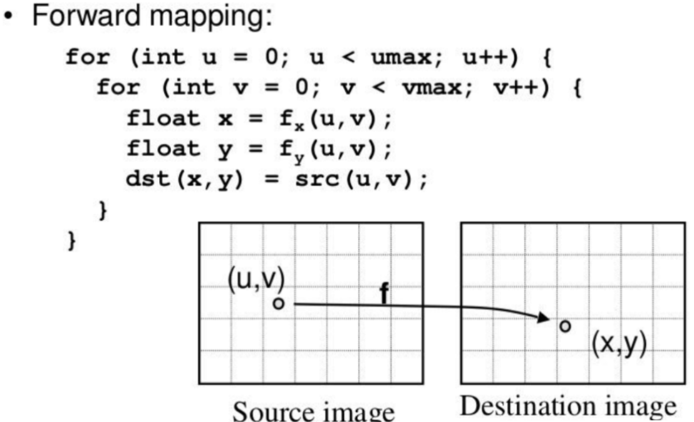
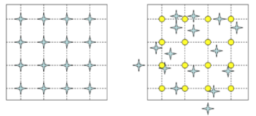
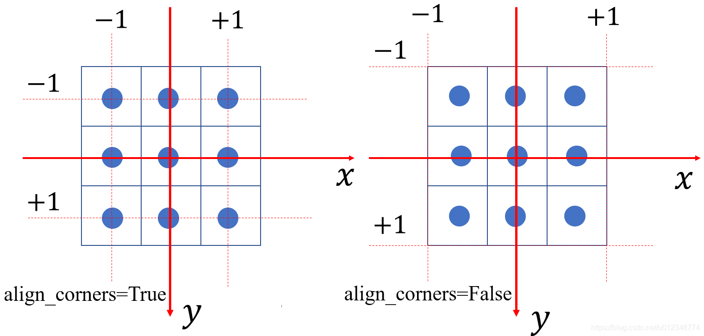

---

title:  光流

date:  2024-10-30 11:28:00

tags:  [风格迁移,深度学习,论文]

categories:  [风格迁移,深度学习,论文,视频]

comment:  false

toc:  true

---

# 

<!--more-->


[参考链接1](https://blog.csdn.net/weixin_54338498/article/details/135751852)

[参考链接2](https://yanqs.blog.csdn.net/article/details/104433061?spm=1001.2101.3001.6650.8&utm_medium=distribute.pc_relevant.none-task-blog-2%7Edefault%7EVECTOR_COMMERCIAL%7ERRF-8-104433061-blog-121837939.235%5Ev43%5Epc_blog_bottom_relevance_base7&depth_1-utm_source=distribute.pc_relevant.none-task-blog-2%7Edefault%7EVECTOR_COMMERCIAL%7ERRF-8-104433061-blog-121837939.235%5Ev43%5Epc_blog_bottom_relevance_base7&utm_relevant_index=12)

[参考链接3](https://blog.csdn.net/qq_40968179/article/details/128093033)

-  **稠密光流**（对图像中的每个像素点都计算光流） 

# 0. Image Warping

- 一种图像Transform的算法

## 0.1 Forward Warping

### 1） 概念理解

-  **把source_image中点的值直接warp到destination_image中对应点上** 

  -  <font color=Red>遍历`source image`</font>中的每个点`p_source`，乘以从`source image`到`destination image`的`affine matrix`，将其投影到`destination image`中得到`p_destination`，如果`p_destination`的坐标不是整数，则进行四舍五入取整

    

    

  - 这样会产生一个问题： `destination image`中有的位置没有从`source image`中投影过来的点，有的位置有多个从`source image`中投影过来的点，所以会产生很多空洞，产生类似波纹的效果。 

    

    

### 2）代码理解

>该部分可以在理解光流之后再回看

- 例子：
- 

## 0.2 Backward Warping

### 1）概念理解

-  **把destination_image中的点warp到source_image对应点上，找最近的点的值** 

  -  <font color=Red>遍历destination image</font>中的每个点p_destination，乘以destination image到source image的affine matrix，得这个点在source image中的对应点p_source，令p_destination的像素值等于p_source的值，如果p_source的坐标不是整数，则采用插值逼近的方法进行近似，因此不会产生的Forward Warping的问题。


  

  

  - 前面是由source_image + f，将source_image每个点映射到dest_image

  - 现在是对dest_image中的每个点，去source_image找答案

    

    

### 2）代码理解

>该部分可以在理解光流之后再回看

- 假设输入图片：
  
  ```python
  1  2  3  4
  5  6  7  8
  9  10 11 12
  13 14 15 16
  ```
  
- 希望将该图片左边两列上移一行，右边两列下移一行。那么x轴不动，在y轴移动

- 这里移动一个单位对应的值需要注意，正常以为取 (-0.5, 0.5) 就是不动，然后加减1对应移动一个单位。这里是取 (0, 1) 范围时，不动。因此这里以0.5作为中心。对应的光流矩阵：
  
  ```python
    [[[[0.5,0.5,0.5,0.5],
       [0.5,0.5,0.5,0.5],
       [0.5,0.5,0.5,0.5],
       [0.5,0.5,0.5,0.5]],
         [[1.5,1.5,-0.5,-0.5],
          [1.5,1.5,-0.5,-0.5],
          [1.5,1.5,-0.5,-0.5],
          [1.5,1.5,-0.5,-0.5]]]]
  ```

```python
import torch
from einops import rearrange
from torch.nn.functional import grid_sample
import torchvision.transforms as T
def coords_grid(batch, ht, wd, device):
    # Adapted from https://github.com/princeton-vl/RAFT/blob/master/core/utils/utils.py
    coords = torch.meshgrid(torch.arange(
        ht, device=device), torch.arange(wd, device=device))
    coords = torch.stack(coords[::-1], dim=0).float()
    return coords[None].repeat(batch, 1, 1, 1)
# unit = 2/3
device = "cuda:1"

def warp_latents_independently( latents, reference_flow):
    device = latents.device
    _, _, H, W = reference_flow.size()#7,2,512,512 #获取 reference_flow 张量的大小，通常它是一个包含流场（flow）的张量，表示参考图像的每个像素的位移量。
    b, _, f, h, w = latents.size() #1,4,7,64,64
    assert b == 1
    #生成一个 坐标网格（通常是一个 [f, H, W, 2] 的张量），表示一个图像的每个像素的 (x, y) 坐标。
    coords0 = coords_grid(f, H, W, device=latents.device).to(latents.dtype) #7,2,512,512

    coords_t0 = coords0 + reference_flow #将生成的坐标网格与 reference_flow 相加。因此，这个操作会将每个 (x, y) 坐标根据参考流的位移进行调整。
    # 将 coords_t0 的坐标值进行归一化处理,
    coords_t0[:, 0] /= W # 将 x 坐标除以宽度 W，将其缩放到 [0, 1] 范围。
    coords_t0[:, 1] /= H

    coords_t0 = coords_t0 * 2.0 - 1.0 #将坐标转换到 [-1, 1] 范围

    coords_t0 = T.Resize((h, w))(coords_t0) #将坐标网格调整到与 latents 张量相同的大小。

    coords_t0 = rearrange(coords_t0, 'f c h w -> f h w c')

    latents_0 = rearrange(latents[0], 'c f h w -> f  c  h w') #因为这里的batchsize=1，所以我们只取第一个元素。
    warped = grid_sample(latents_0, coords_t0, #通过网格采样进行扭曲
                            mode='nearest', padding_mode='reflection') #使用最近邻插值来计算新的图像值, 如果采样的坐标超出了图像边界，则使用反射填充。

    warped = rearrange(warped, '(b f) c h w -> b c f h w', f=f)
    return warped

if __name__ == "__main__":
    size=4

    #根据size创建一个size*size的矩阵，矩阵元素从1开始递增
    latents = torch.arange(1, size*size+1).reshape(1, 1,1, size, size).float().to(device)
    print("latents:",latents)
    
    reference_flow = torch.tensor([[[[0.5,0.5,0.5,0.5],
                                     [0.5,0.5,0.5,0.5],
                                     [0.5,0.5,0.5,0.5],
                                     [0.5,0.5,0.5,0.5]],
                                        [[1.5,1.5,-0.5,-0.5],
                                        [1.5,1.5,-0.5,-0.5],
                                        [1.5,1.5,-0.5,-0.5],
                                        [1.5,1.5,-0.5,-0.5]]]]).float().to(device)
    print("reference_flow:",reference_flow)

    warped = warp_latents_independently(latents, reference_flow)
    print(warped)
```

- 输出

  ```python
  tensor([[[[[ 5.,  6.,  3.,  4.],
             [ 9., 10.,  3.,  4.],
             [13., 14.,  7.,  8.],
             [13., 14., 11., 12.]]]]], device='cuda:1')
  ```

- **仅针对左上角第一个元素**（从光流矩阵的角度看），把他替换成左下角第一个元素。这时的理解逻辑是：`对于左上角这个元素，向下位移3个单位找到他的替代点`，此时的光流为:

  ```python
  reference_flow = torch.tensor([[[[0.5,0.5,0.5,0.5],
                                   [0.5,0.5,0.5,0.5],
                                   [0.5,0.5,0.5,0.5],
                                   [0.5,0.5,0.5,0.5]],
                                  [[3.5,0.5,0.5,0.5],
                                   [0.5,0.5,0.5,0.5],
                                   [0.5,0.5,0.5,0.5],
                                   [0.5,0.5,0.5,0.5]]]]).float().to(device)
  ```

### 3） 图像wrap函数理解

- 对于上面的 `warp_latents_independently` 函数，通过如下例子进行理解：

  ```python
  def warp_latents_independently( latents, reference_flow ):
      # latents=[[[[  #1,1,1,2,2
      # 	[1,2],
      #   [3,4]
      # ]]]]
      
      # reference_flow = [[[[1,2,3,4], #1,2,4,4
      #                     [2,3,4,5],
      #                     [3,4,5,6],
      #                     [4,5,6,7]],
      #                        [[10,11,12,13],
      #                         [2 ,2 ,2 ,2 ],
      #                         [1 ,3 ,5 ,8 ],
      #                         [1 ,1 ,2 ,2 ]]]]
      
      device = latents.device
      _, _, H, W = reference_flow.size() #1,2,4,4
      b, _, f, h, w = latents.size() #1,1,1,2,2
      assert b == 1
      coords0 = coords_grid(f, H, W, device=latents.device).to(latents.dtype) 
      #coords0 = [[[[0,1,2,3], #1,2,4,4
      #             [0,1,2,3],
      #             [0,1,2,3],
      #             [0,1,2,3]],
      #               [[0,0,0,0],
      #               [1,1,1,1],
      #               [2,2,2,2],
      #               [3,3,3,3]]]]
      coords_t0 = coords0 + reference_flow
      #coords_t0 = [[[[1,3,5,7], #1,2,4,4
      #               [2,4,6,8],
      #               [3,5,7,9],
      #               [4,6,8,10]],
      #                 [[10,11,12,13],
      #                  [3 ,3 ,3 ,3 ],
      #                  [3 ,5 ,7 ,10],
      #                  [4 ,4 ,5 ,5]]]]
      coords_t0[:, 0] /= W
      coords_t0[:, 1] /= H
  
      coords_t0 = coords_t0 * 2.0 - 1.0
      #coords_t0 = [[[[-0.5, 0.5, 1.5, 2.5], #1,2,4,4
      #               [ 0  , 1  , 2  , 3  ],
      #               [ 0.5, 1.5, 2.5, 3.5],
      #               [ 1  , 2  , 3  , 4  ]],
      #                 [[4  , 4.5, 5  , 5.5],
      #                  [0.5, 0.5, 0.5, 0.5],
      #                  [0.5, 1.5, 2.5, 4  ],
      #                  [1  , 1  , 1.5, 1.5]]]]
      coords_t0 = T.Resize((h, w))(coords_t0)
      #相邻四个取平均：左上角四个：-0.5, 0.5, 0, 1取平均=0.25
      #coords_t0 = [[[[0.25, 2.25], #1,2,2,2
      #               [1.25, 3.25]],
      #                 [[2.375, 2.875],
      #                  [1    , 2.375]]]]
      coords_t0 = rearrange(coords_t0, 'f c h w -> f h w c')
  
      latents_0 = rearrange(latents[0], 'c f h w -> f  c  h w')
      warped = grid_sample(latents_0, coords_t0,
                              mode='nearest', padding_mode='reflection')
      # warped=[[[[  #1,1,1,2,2
      # 	[2,1],
      #   [4,1]
      # ]]]]
      warped = rearrange(warped, '(b f) c h w -> b c f h w', f=f)
      return warped
  ```

- #### grid_sample函数理解：

  - 输入参数：

    - `input`

    - `grid`

    - `mode`：采样的方式，nearest就是最邻近采样，bilinear是双线性插值。

    - `padding_mode`：边缘的处理模式，zeros是边缘补充部分为0，border是边缘补充部分直接复制边缘区域，reflection是边缘补充部分为根据边缘的镜像

    - `align_corners`：当align_corners=True时，坐标归一化范围是图像四个角点的中心;当align_corners=False时，坐标归一化范围是图像四个角点靠外的角点。如下，其中每一个方格代表一个像素，并且像素坐标在方格中央

      

      

      - 举例：

        ```python
        #输入图片
        test = tensor([[[[1., 2., 3.],
                          [4., 5., 6.],
                          [7., 8., 9.]]]])
        #采样点
        sample_one = torch.zeros(1,1,1,2)
        sample_one [0][0][0][0] = -1  # x
        sample_one [0][0][0][1] = -1  # y
        
        sample_two = torch.zeros(1,1,1,2)
        sample_two [0][0][0][0] = -2/3  # x
        sample_two [0][0][0][1] = -2/3  # y
        
        sample_thr = torch.zeros(1,1,1,2)
        sample_thr [0][0][0][0] = -0.5  # x
        sample_thr [0][0][0][1] = -0.5  # y
        
        #采样
        result_one = torch.nn.functional.grid_sample(test,sample,mode='bilinear',padding_mode="zeros",align_corners=True) #左图，(-1, -1)
        print(result_one )
        
        result_two= torch.nn.functional.grid_sample(test,sample_two ,mode='bilinear',padding_mode="zeros",align_corners=False)
        print(result_two) #右图，(-2/3, -2/3)
        
        result_thr= torch.nn.functional.grid_sample(test,sample_thr ,mode='bilinear',padding_mode="zeros",align_corners=True)
        print(result_thr) #左图，双线性插值(1*0.5+2*0.5)*0.5+(4*0.5+5*0.5)*0.5=3
        
        ```

  - 计算方式：继续上一节的例子

    ```python
    # latents=[[[[  #1,1,1,2,2
    # 	[1,2],
    #   [3,4]
    # ]]]]
    
    #coords_t0 = [[[[0.25, 2.25], #1,2,2,2输入grid_sample时还要做reshape
    #               [1.25, 3.25]],
    #                 [[2.375, 2.875],
    #                  [1    , 2.375]]]]
    
    
    ```

    1. **根据输入的参数 reflection ，使用反射填充进行归一化**

        - **第一个坐标点**：`(0.25, 2.375)`
          - x=0.25 在范围内，无需处理。
          - y=2.375 → 反射为 `1 - (2.375 - 1) = -0.375`。
          - 处理后坐标：`(0.25, -0.375)`。
        - **第二个坐标点**：`(2.25, 2.875)`
          - x=2.25 → 反射为 `1 - (2.25 - 1) = -0.25`。
          - y=2.875 → 反射为 `1 - (2.875 - 1) = -0.875`。
          - 处理后坐标：`(-0.25, -0.875)`。
        - **第三个坐标点**：`(1.25, 1.0)`
          - x=1.25 → 反射为 `1 - (1.25 - 1) = 0.75`。
          - y=1.0 在边界上，无需处理。
          - 处理后坐标：`(0.75, 1.0)`。
        - **第四个坐标点**：`(3.25, 2.375)`
          - x=3.25 → 多次反射后为 `-0.75`。
          - y=2.375 → 反射为 `1 - (2.375 - 1) = -0.375`。
          - 处理后坐标：`(-0.75, -0.375)`。

    2. **根据参数nearest，归一化坐标转像素坐标**

        转换公式：`pixel = (normalized + 1) * (size / 2) - 0.5`（align_corners=False）。

        - **第一个坐标点**：`(0.25, -0.375)`
          - x: `(0.25 + 1) * 1 - 0.5 = 0.75` → 四舍五入到 **1**。
          - y: `(-0.375 + 1) * 1 - 0.5 = 0.125` → 四舍五入到 **0**。
          - 值：`input[0, 0, 0, 1] = 2`。
        - **第二个坐标点**：`(-0.25, -0.875)`
          - x: `(-0.25 + 1) * 1 - 0.5 = 0.25` → 四舍五入到 **0**。
          - y: `(-0.875 + 1) * 1 - 0.5 = -0.375` → 反射后为 **0.375**，四舍五入到 **0**。
          - 值：`input[0, 0, 0, 0] = 1`。
        - **第三个坐标点**：`(0.75, 1.0)`
          - x: `(0.75 + 1) * 1 - 0.5 = 1.25` → 反射后为 **0.75**，四舍五入到 **1**。
          - y: `(1.0 + 1) * 1 - 0.5 = 1.5` → 反射后为 **0.5**，四舍五入到 **1**。
          - 值：`input[0, 0, 1, 1] = 4`。
        - **第四个坐标点**：`(-0.75, -0.375)`
          - x: `(-0.75 + 1) * 1 - 0.5 = -0.25` → 反射后为 **0.25**，四舍五入到 **0**。
          - y: `(-0.375 + 1) * 1 - 0.5 = 0.125` → 四舍五入到 **0**。
          - 值：`input[0, 0, 0, 0] = 1`。
        
    3. **最终输出**：
    
        ```python
        [[[[2, 1],
           [4, 1]]]]
        ```
    
        

# 1. 光流（optical flow）

- **光流**是一个**二维速度场**，表示 `每个像素pixel` 从参考图像到目标图像的`运动偏移`。 数学定义如下：
  - 给定两个图像img1，img2 $\in R^ {HW3}$
  - flow $\in R^ {HW2}$ ，其中channel=2分别描述水平和垂直方向的像素位移。

-  这里还要注意的一点：**像素坐标偏移量的`大小`\**当然就是通过\**光流数组中的数值大小**体现出来的，而**偏移的**`方向`是通过**光流数组中的正负**体现出来的。在`x方向上`，正值表示物体向左移动，而负值表示物体向右移动；在`y方向上`，正值表示物体向上移动，而负值表示物体向下移动。 