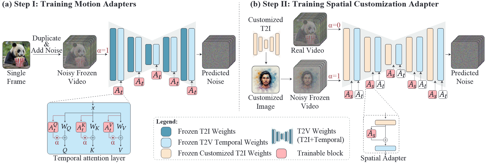

#

<!--more-->

# 0. Abstract

- 定制T2I模型最近取得了巨大的进展。然而，将这一进展扩展到视频生成仍处于起步阶段，这主要是由于缺乏定制化的视频数据。

- 本文介绍了Still-Moving，这是一个用于定制T2V模型的框架，不需要任何定制的视频数据。
- 该框架适用于T2V模型，其中视频模型建立在T2I模型上（例如，经由膨胀）。
- 我们假设有一个T2I模型的定制版本（已经训练好的lora+SD），它仅在静态图像数据上训练（例如，使用DreamBooth或StyleDrop）。天真地将上述定制的T2I模型的权重插入T2V模型通常会导致显著的artifacts或对定制数据的遵守不足。（分布发生了偏移？）
- 为了克服这个问题，我们训练轻量级空间适配器来调整由注入的T2I层产生的特征。重要的是，我们的适配器是在“**冻结视频**”（即重复图像）上训练的，这些视频是从定制的T2I模型生成的图像样本构建的。这种训练由一种新颖的运动适配器模块促进，它允许我们在这种静态视频上进行训练，同时保留视频模型的运动先验。
- 在测试时，我们移除运动适配器模块，只留下经过训练的空间适配器。这恢复了T2V模型的运动先验，同时遵守定制的T2I模型的空间先验。

# 1. Introduction

- 我们的方法利用了在定制T2I模型方面取得的巨大进展，旨在将其直接扩展到视频生成领域。

- 视频定制的一种简单方法是简单地用定制的T2I模型的权重替换T2V模型中的T2I权重。然而，定制的T2I模型的权重经常偏离膨胀的T2V模型中的权重，这导致特征分布的不匹配。因此，正如最近在几项工作【8,36】中观察到的，这种方法可能会导致显著的伪影或定制数据的低保真度（见图2）。在这项工作中，我们提出了一个通用框架，用于利用定制图像模型的生成2D先验，同时保留预训练T2V模型的运动先验。

  

  

- 理想情况下，我们希望通过对其输出帧提供直接监督来微调T2V模型。但是，我们无法访问定制内容的任何视频数据。我们克服这一挑战的关键想法是在“**冻结视频**”上微调T2V模型，这些视频是通过在时间上复制定制T2I模型生成的静态图像来构建的。这种方法的**关键挑战是保留T2V模型的运动先验，并避免教导它生成静态内容**。
- 我们分两个阶段应对这一挑战。我们首先训练**运动适配器**，它是时间注意力层的轻量级残差，导致T2V模型生成静态视频。**然后，我们将这些运动适配器用作运动开关**：我们打开它们**以允许我们在冻结的定制视频上微调T2V模型**，然后移除它们以恢复模型的运动先验。T2V微调是通过注入定制的T2I权重并仅训练轻量级空间适配器来修正特征分布中的不匹配来实现的。

- 我们的方法能够将定制T2I模型的空间先验注入T2V模型，同时受益于两个模型各自丰富的先验。我们表明，我们的框架优于现有的方法，现有的方法没有特别关注时间层。我们的框架是通用的、轻量级的，可以应用于任何建立在T2I模型之上的T2V模型。

# 3. Method

- 给定从T2I模型M膨胀的视频模型V和从M微调的定制T2I模型M1，我们的目标是实现将定制权重M1“即插即用”注入V。简单地用M1代替M的天真方法由于替换引起的特征分布的偏移而导致不令人满意的结果（图2）。为了减轻这种转变，我们建议训练轻量级（在参数数量和优化步骤数量方面）空间适配器，其任务是将注入层输出端的激活从M 1投影回V的时间层。
- 这种方法的一个主要挑战是应该对适配器进行定制视频数据的训练，这通常是无法实现的。请注意，虽然静止图像可以被复制以形成（冻结的）视频，但对这种冻结的视频进行天真的训练会导致运动生成能力的丧失（参见第4.3节）。**为了克服这一点，我们建议采用新的运动适配器来实现对图像数据的训练，而不会丢失模型的运动先验**。在下文中，我们简要描述膨胀方法，然后详细介绍我们方法的两个主要组件，即运动适配器和空间适配器。

## 3.2 Motion Adapter

- 我们方法的一个关键组成部分是在**冻结图像数据**上训练V（视频模型）的权重的能力。为了在不引入分布之外的输入的情况下实现这一目标，我们建议训练轻量级运动适配器来控制模型生成的视频中运动的存在。**运动适配器在普通的、非定制的T2V模型上训练一次**。我们的实现基于时间注意力投影矩阵的LoRA：
  $$
  \tilde W = W + \alpha \cdot A_t ^{W,down} \cdot A_t ^ {W,up}
  $$

  - 对于所有WQ，WK，WV 。这里α是适配器尺度，$A^{down} \in \mathbb R ^ {C \times r}$，$A^{up} \in \mathbb R ^ {r \times d_k}$是适配器矩阵。**矩阵Adown 用随机值初始化，而Aup 被初始化为零，使得在训练之前，模型等效于V。**

- **在训练过程中，我们设置$\alpha = 1$，并使用来自模型训练集（WebVid）中的一小组视频（更多细节见SM）。对于每个视频，我们随机选择单个帧，复制F次，并用扩散去噪目标训练适配器层。**换句话说，**运动适配器被训练成从视频模型的分布生成描绘复制随机帧的冻结视频**（见图3（a））。一旦被训练，运动适配器就能够**在冻结的数据上训练视频模型权重**（先训练lora，然后训练视频权重？这里所谓的视频模型的权重按照“正如3.3所说”，看来应该是视频模型里的图像权重），正如我们在3.3中详细介绍的那样。**请注意，通过设置$\alpha = 0$，模型保留了其生成运动的能力。有趣的是，我们发现运动适配器控制运动量的能力推广到负尺度。例如，当设置$\alpha = -1$时，模型产生运动量增加的视频**（见SM）。因此，除了允许在图像上定制T2V模型之外，运动适配器还可以在推理期间用于控制生成视频中的运动量。

  

  

## 3.3 Spatial Adapters

- 我们方法的核心在于这样一个前提，即特征分布的偏差可以使用简单的线性投影来修补。因此，我们建议在每个注入的定制T2I层之后添加空间适配器（见图3（b））。这些适配器的任务是**修改时间层输入处的分布间隙**。因此，它们的训练需要在整个视频模型中传播梯度。类似于运动适配器，空间适配器被实现为低秩矩阵的乘法：
  $$
  Adapter(X) = X \cdot (I + A_s ^ {down} \cdot A_ s ^ { up })
  $$

  - 其中$A^{down} \in \mathbb R ^ {C \times r}$，$A^{up} \in \mathbb R ^ {r \times C}$是特定于层的低秩适配器矩阵。类似于运动适配器，Adown 、Aup分别随机初始化并用零初始化，使得在训练之前模型等同于V。我们使用**图像和视频的组合来训练具有扩散重建损失的空间适配器**。具体来说，我们使用**由定制的T2I模型M1生成的图像和40个非定制的视频**来保存膨胀模型的先验，遵循DreamBooth【32】（见图3（b））。我们对冻结视频采用比例为$\alpha = 1$的运动适配器，对先验保存视频采用比例为$\alpha = 0$的运动适配器。