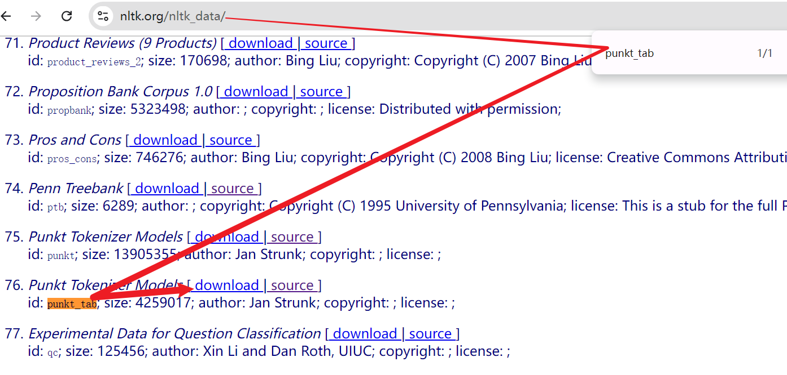

#
<!--more-->

# 1- QAnything项目创建

- 两种版本：
  -  python版本和docker版本 python版本适合快速体验新功能
  - docker版本适合二次开发并用于实际生产环境，且新功能暂缓支持 


## 1.1 python版本安装

### 1.1.1 安装

```bash
conda create -n qanything-python python=3.10
conda activate qanything-python
git clone -b qanything-python https://github.com/netease-youdao/QAnything.git
cd QAnything
pip install -e .
```


### 1.1.2 修改

- #### 更改运行GPU

  - 1. 修改`scripts/base_run.sh`中

    ```bash
    CUDA_VISIBLE_DEVICES=6 
    ```

  - 2. 同时将`qanything_kernel/qanything_server/sanic_api.py`的133行注释（感觉像是代码逻辑问题？）：

    ```python
    #os.environ["CUDA_VISIBLE_DEVICES"] = args.device_id
    ```

- #### pdf无法解析，并提示（可能是因为传入英文文档？）：

  ```bash
  **********************************************************************
    Resource punkt_tab not found.
    Please use the NLTK Downloader to obtain the resource:
  
    >>> import nltk
    >>> nltk.download('punkt_tab')
  
    For more information see: https://www.nltk.org/data.html
  
    Attempted to load tokenizers/punkt_tab/english/
  
    Searched in:
      - 
  **********************************************************************
  ```

  - 手动下载：https://www.nltk.org/nltk_data/

    - 1. ctrl + f搜索：`punkt_tab`

      

      

    - 2. 根据报错信息，代码没有找到`tokenizers/punkt_tab/english/`，尝试了一遍`Searched in:`列出的路径，发现需要将下载的文件夹解压到：`qanything_kernel/nltk_data/tokenizers`中

    - 3. 同理，后面可能还会报错缺少：`averaged_perceptron_tagger_eng`。只需要按照类似的方法，下载后解压到：`qanything_kernel/nltk_data/taggers`

- #### 使用更强的pdf解析

  - 修改`config.py`中：

    ```python
    pdf_config = {
        # 设置是否使用快速PDF解析器，设置为False时，使用优化后的PDF解析器，但速度下降
        "USE_FAST_PDF_PARSER": False
    }
    ```

    

