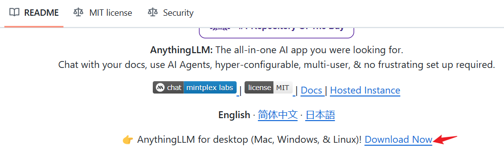

```
title: Linux中部署deepseek
date: 2025-02-10 16:00:00
toc: true
tags: [项目, deepseek]
categories: [项目]
```

\#

<!--more-->


https://www.cnblogs.com/dechinphy/p/18699554/deepseek


## 1. 安装Ollama

- [官网](https://ollama.com/) 选择Linux系统

  ```shell
  curl -fsSL https://ollama.com/install.sh | sh
  ```

- 验证：

  ```shell
  ollama --help
  ```

  ```
  Large language model runner
  ```

  

## 2. 下载DeepSeek模型

- 访问 [https://ollama.com/library/deepseek-r1](https://ollama.com/library/deepseek-r1) 选择你需要的模型

  ```shell
  ollama run deepseek-r1:32b
  ```

  

## 3. 安装界面

### 3.1 使用ollama-webui


```shell
git clone https://github.com/ollama-webui/ollama-webui-lite
cd ollama-webui-lite
npm config set registry http://mirrors.cloud.tencent.com/npm/ #使用镜像
npm install
npm run dev

```


### 3.2 使用anythingllm

- 使用[anything llm](https://github.com/Mintplex-Labs/anything-llm) ，点击下载

  

  

- 下载，启动

  ```shell
  curl -fsSL https://cdn.anythingllm.com/latest/installer.sh | sh
  ~/AnythingLLMDesktop/start
  
  ```

  