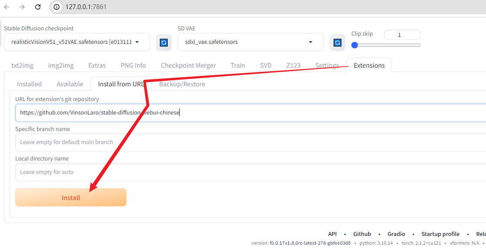
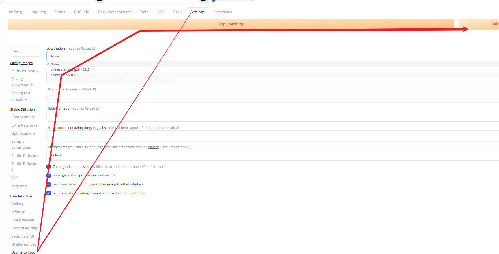
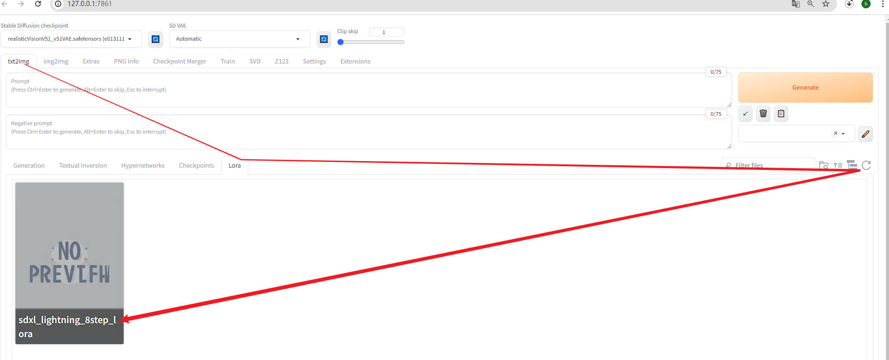

#
<!--more-->

# 1- stable diffusion项目创建

## 1. 下载项目


  ```bash
mkdir big_model
cd big_model
git clone https://github.com/lllyasviel/stable-diffusion-webui-forge.git
cd stable-diffusion-webui-forge

  ```


## 2. 安装虚拟环境

- 查看python环境（需要python3.10）：

  ```bash
  python --version
  ```

  
  - 如果你的python版本不对，可以先在conda安装一个python3.10：
  
      ```bash
      conda create --name python310 python=3.10
      conda activate python310
      ```


- 创建虚拟环境

  ```bash
  python -m venv ./venv
  conda deactivate
  ```


  - 你也可以直接把别人的`venv`文件夹拷贝过来，然后需要修改`pyvenv.cfg`里面的python解释器路径。


     - 拷贝过来后可能没有执行权限，需要：

      ```bash
      chmod +x 项目路径/venv/bin/python
      chmod +x 项目路径/venv/bin/pip
      python -V
      pip list
      ```

   - 如果`pip list命令`出现如下错误：


      - 看看`venv/pyvenv.cfg`指向的python路径是不是本地conda环境（指向项目的`venv`环境时会报错：）

         ```bash
         Fatal Python error: init_fs_encoding: failed to get the Python codec of the filesystem encoding
         Python runtime state: core initialized
         ModuleNotFoundError: No module named 'encodings'
         ```

      - 如果出现：

         ```bash
         valueerror: failed to parse cpython sys.version: '3.10.6 | packaged by conda-forge | (main, aug 22 2022, 20:36:39) [gcc 10.4.0]'
         ```

         - 就在`conda/envs/虚拟环境/lib/python3.x/platform.py`中找到（添加第二行）：

           ```python
           _sys_version_parser = re.compile(
               r'([\w.+]+)\s*'  # "version<space>"
               r'(?:\|[^|]*\|)*\s*' #去掉'|Anaconda xxx|'等,避免出现failed to parse CPython sys.version
               r'\(#?([^,]+)'  # "(#buildno"
               r'(?:,\s*([\w ]*)'  # ", builddate"
               r'(?:,\s*([\w :]*))?)?\)\s*'  # ", buildtime)<space>"
               r'\[([^\]]+)\]?', re.ASCII)  # "[compiler]"
           ```

           

- 使用虚拟环境

   -  windows

      ```bash
      venv\Scripts\activate
      
      ```
   
   
   
   - linux
   
       ```bash
       source ./venv/bin/activate

       ```


## 3. 运行

- 使用虚拟环境：先在stable-diffusion-webui-forge/webui.sh最前面加上：（这样以后就不用每次手动激活虚拟环境了）（windows类似，可能语法不同）

  ```bash
  . venv/bin/activate
  
  ```

- windows:

  ```bash
  .\webui.bat
  
  ```

- linux:

  ```bash
  bash webui.sh --xformers
  
  ```

- 运行后会自动下载一些模型权重，如果中途断了可能是网络问题，重新启动


## 4. 添加扩展

- 扩展可以直接将别人的`stable-diffusion-webui-forge/extensions/`里的扩展拷贝过来

### 4.1 汉化

```
https://github.com/VinsonLaro/stable-diffusion-webui-chinese
```




  

 

- 可以以在`Available`中，取消所有的勾选，然后在浏览器ctrl+f搜索simplif进行搜索。
- 其他扩展的安装类似（需要有网络）

## 5. 添加基础模型

- 基础模型可以从别人的`stable-diffusion-webui-forge/models/`里面拷贝过来（例如我需要sd模型，就将`models/Stable-diffusion/sdxl_lightning_8step.safetensors`拷贝到自己的对应目录。）

- [模型网址](https://huggingface.co/ByteDance/SDXL-Lightning/tree/main)

### 5.1 Lora基础模型

- 如果你想自己下载：

    ```bash
    cd ../stable-diffusion-webui-forge/models/Lora
    wget https://huggingface.co/ByteDance/SDXL-Lightning/resolve/main/sdxl_lightning_8step_lora.safetensors?download=true
    
    ```

- windows powershell下可用：

  ```bash
  Invoke-WebRequest -Uri "https://huggingface.co/ByteDance/SDXL-Lightning/resolve/main/sdxl_lightning_8step_lora.safetensors?download=true" -OutFile "sdxl_lightning_8step_lora.safetensors"
  
  ```

- 在界面刷新即可看到：

  

  

### 5.2 stable diffusion基础模型

- 如果你想自己下载：
    ```bash
    cd ../Stable-diffusion
    wget https://huggingface.co/stabilityai/stable-diffusion-xl-base-1.0/resolve/main/sd_xl_base_1.0.safetensors?download=true
    
    ```

    - 注意这里下载的是base模型，你也可以试试别的，比如sdxl_lightning，但是后续训练使用
    
      ```
      wget https://huggingface.co/ByteDance/SDXL-Lightning/resolve/main/sdxl_lightning_8step.safetensors?download=true
      ```
    
      
    
- windows powershell下可用：

    ```bash
    Invoke-WebRequest -Uri "https://huggingface.co/ByteDance/SDXL-Lightning/resolve/main/sdxl_lightning_8step.safetensors?download=true" -OutFile "sdxl_lightning_8step.safetensors"
    ```

### 5.3 vae基础模型

- 如果你想自己下载：

    ```bash
    cd ../VAE
    wget https://huggingface.co/madebyollin/sdxl-vae-fp16-fix/resolve/main/sdxl.vae.safetensors?download=true
    
    ```
    
    

## 6 默认参数设置

- 网页默认选择的参数位于`stable-diffusion-webui-forge/ui-config.json`，可以修改默认的图片大小等。（也可直接把别人的文件拷过来）


## 7 训练自己的lora: 



