#
<!--more-->


# 2- lora训练

## 2.1 下载

- 方法1：copy

  - 将别人的`lora-scripts`项目文件夹拷贝过来：

    ```bash
    cp -r 原路径/lora-scripts 你的路径/lora-scripts
    ```
    
  - 然后（默认你使用了python3.10）：

    ```bash
    cd lora-scripts
    mv ./venv ./venv_
    python -m venv ./venv
    cp -r ./venv_/lib/python3.10/site-packages ./venv/lib/python3.10/site-packages
    rm -r ./venv_
    source ./venv/bin/activate
    bash run_gui.sh --xformers
    
    ```
    
  - 建议在run_gui.sh最前面加上（运行时会自动使用虚拟环境）：

    ```bash
    . venv/bin/activate
    ```

    

  - 运行完后即可去[2.4 准备数据集](###2.4 准备数据集)

- 方法2：下载
  
- 在big_model目录下载lora项目：
  
  ```bash
  cd ./big_model
  git clone --recurse-submodules https://github.com/Akegarasu/lora-scripts
  ```
    ```bash
  cd lora-scripts
    ```
  
- 安装虚拟环境（确保你的python是3.10）和必要的库
  
  ```bash
  conda activate python310
  python -m venv ./venv
  conda deactivate
  ```
  ```bash
   source ./venv/bin/activate
  ```


## 2.2 运行

- 同理使用虚拟环境，在run_gui.sh最前面加上：

  ```bash
  . venv/bin/activate
  ```

- windows:

  - 国内

    ```bash
    ./install-cn.ps1
    ./run_gui.ps1  --xformers
    
    ```

  - 国外

    ```bash
    ./install.ps1
    ./run_gui.ps1  --xformers
    
    ```

- linux:

  ```bash
  bash install.bash
  bash run_gui.sh --xformers
  
  ```

- 运行后会自动打开本地端口： [http://127.0.0.1:28000](http://127.0.0.1:28000/) 


## 2.3 启动gui （不用看）

- 训练不要使用过小的图片，也不要过大（3000以上）

- 在http://localhost:6006/ 启动 TensorBoard （linux下可能要改改）

  ```bash
  ./tensorboard.ps1
  ```


- 可以通过gui界面训练

  - 也可通过脚本训练：（略）
  - windows：编辑`train.ps1`
    - linux：编辑`train.sh`

## 2.4 准备数据集

- 将图片放到一个文件夹：`10_human`（例子，代表训练迭代10个epoch，图片类型为human）。注意图片不要重名（如1.png与1.jpg）。复制图片路径

- 进入gui界面，粘贴图片路径：

  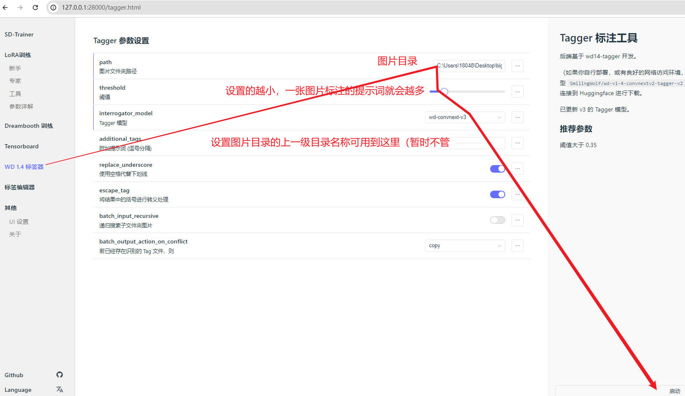

  

- 点击gui右下角的启动按钮，会自动下载tagger模型（如果因为网络问题，无法连接huggingface，可以直接把别人的`lora-scripts/huggingface/hub里面的模型文件夹拷贝过来`）

- 数据集里面就会自动出现每张图片对应的提示词（txt文件）(重名的后果导致两张图片只有一个txt)

  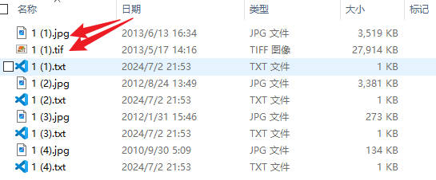

  


## 2.5 编辑标签

- 标签编辑器 -> 输入数据集路径 -> 取消标签txt的备份 -> load

- 原本应该在`Data set Images`区域显示图片预览，但我这里出现了Error（如果你知道怎么办请联系我）

  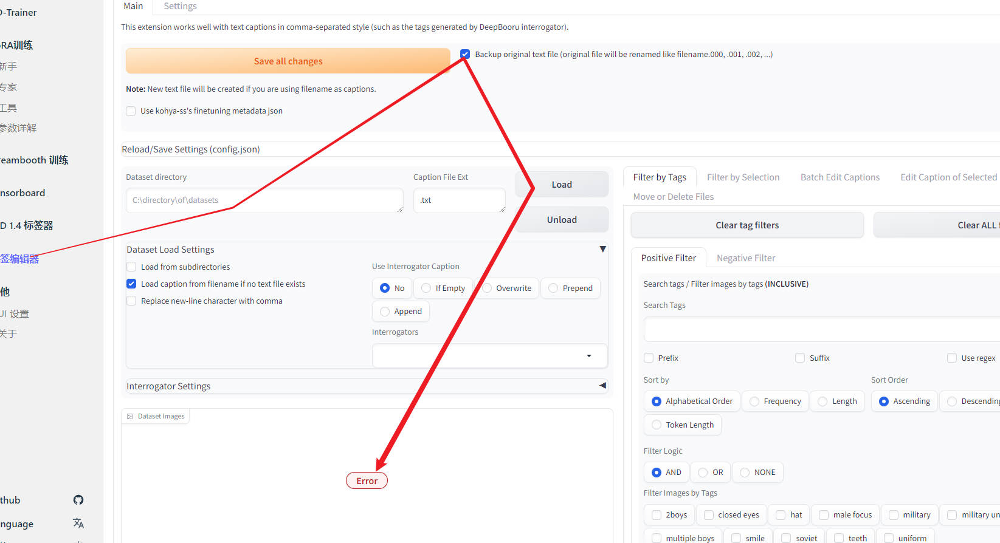

  

- 如果你跟我一样显示Error了，可以点击左边区域的两个按钮，可以显示出标签（勉强也能编辑）

    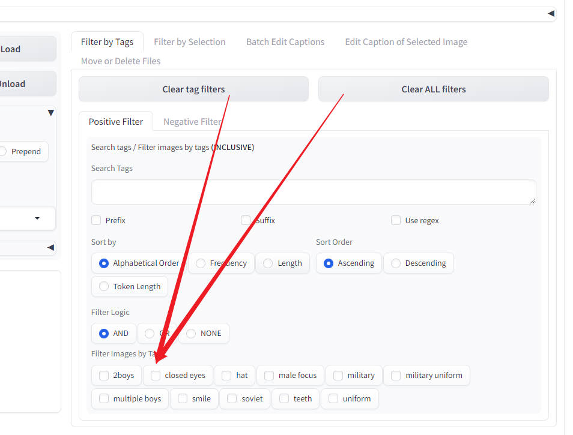

    
    
    - 解决上述问题：在`run_gui.sh`的前面加上：
    
        ```bash
        export GRADIO_TEMP_DIR="home/用户名/tmp"
        ```
    
        - 参考：

### 2.5.1删除/添加标签

- 添加标签：

  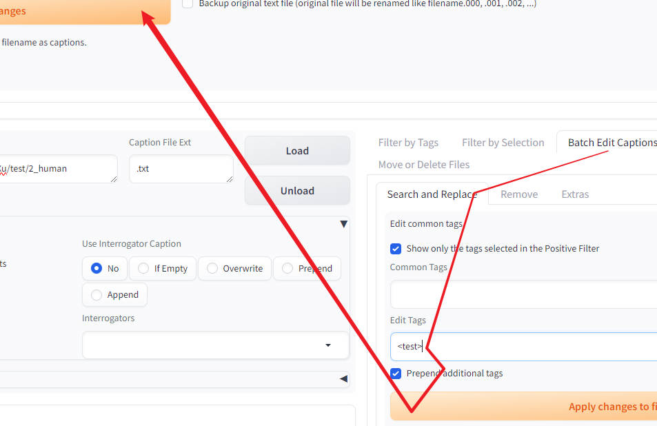

  

- 删除标签：

  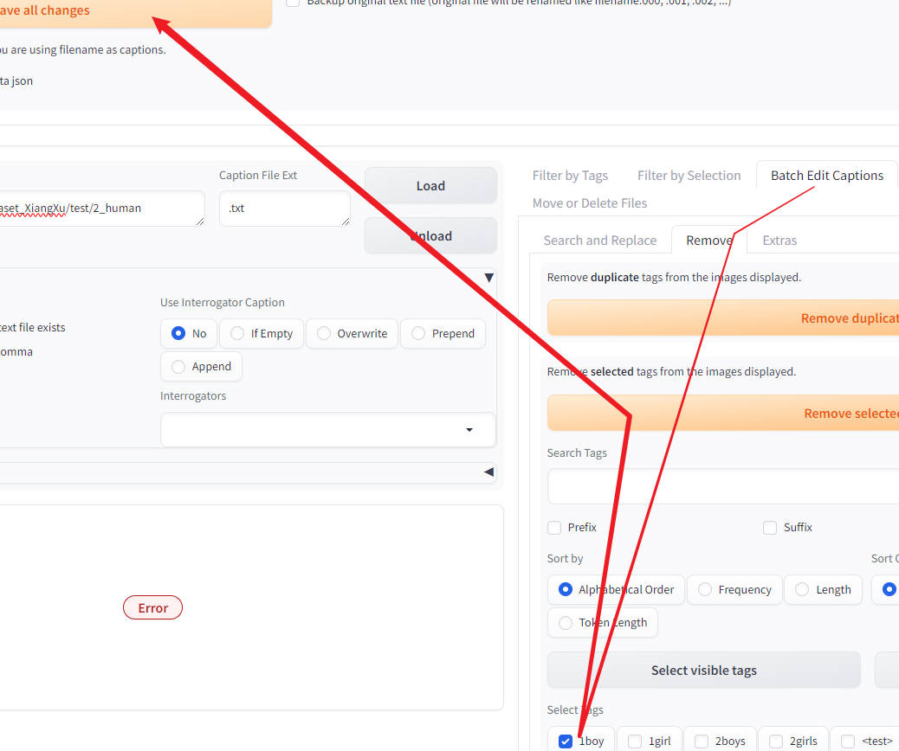

  


## 2.6 训练

- 标签打完后就可以开始训练了，你可以先从别人的`lora-scripts/config/autosave`里面选择一个配置文件下载到本地，然后点击右下角的`导入配置文件`按钮，这样网络参数会跟别人的一致，就可以继续训练别人的模型了，但是有些参数还要自己写上。

- 这里只列一些个人感觉重要的：

  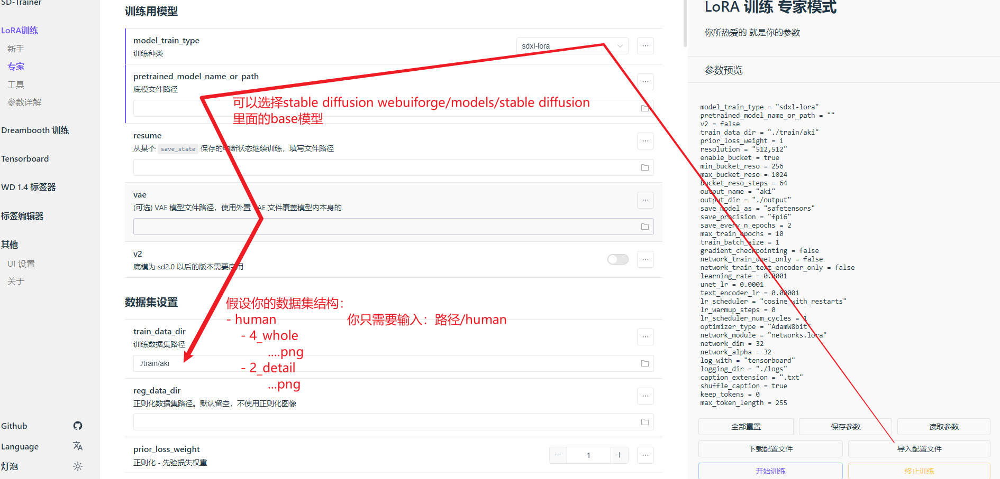

  

  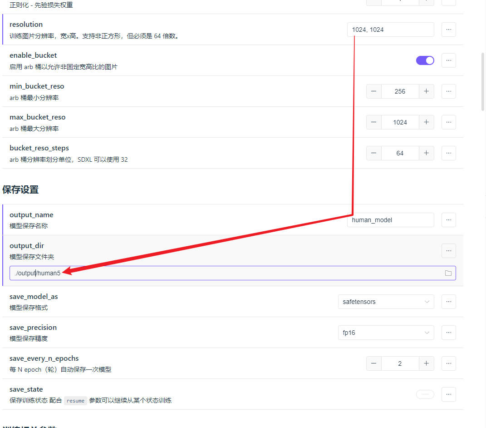

  

  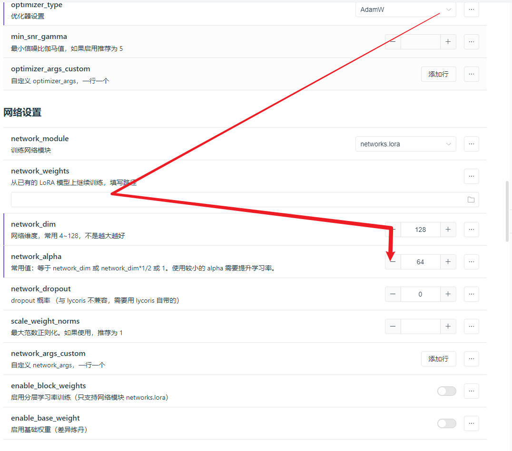

  

  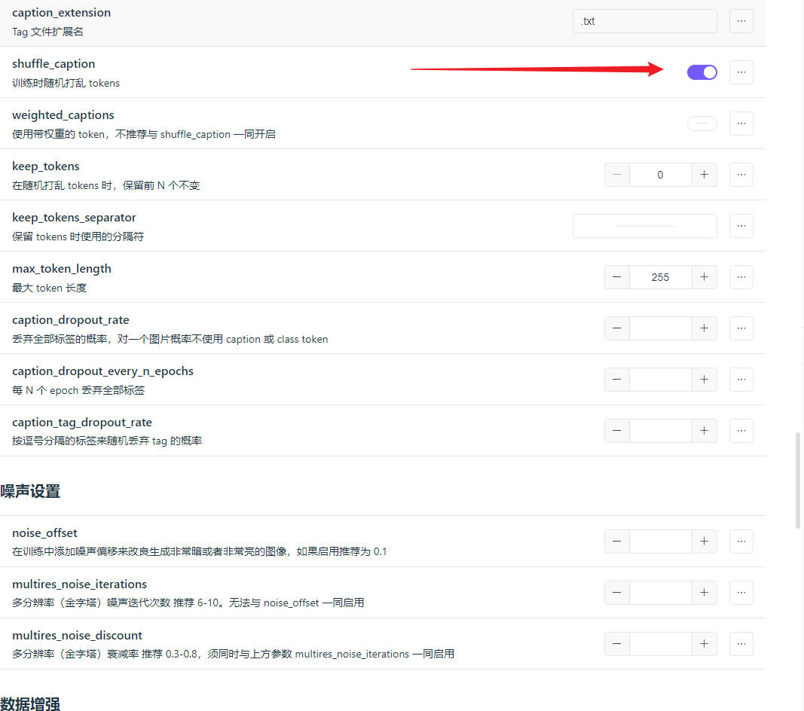
  


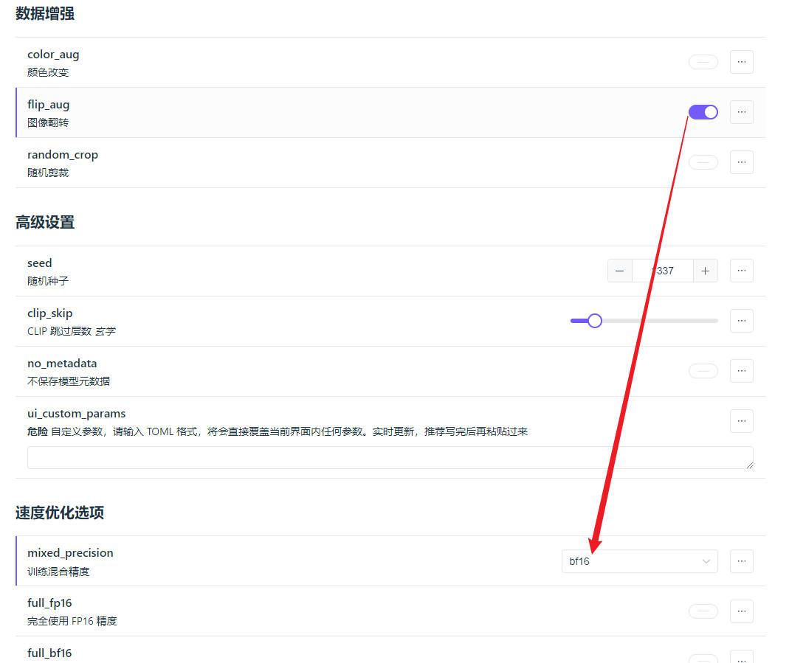


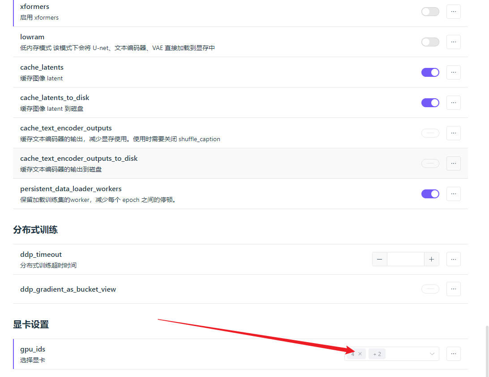


