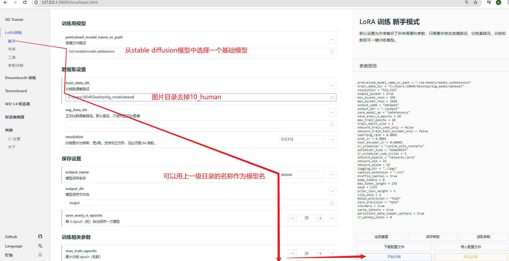

#
<!--more-->


# 2- lora训练

## 2.1 启动gui

- 训练不要使用过小的图片，也不要过大（3000以上）

- 在http://localhost:6006/ 启动 TensorBoard 

  ```bash
  ./tensorboard.ps1
  ```


- 可以通过gui界面训练

  - 也可通过脚本训练：（略）
  - windows：编辑`train.ps1`
    - linux：编辑`train.sh`

## 2.2 准备数据集

- 将图片放到一个文件夹：`10_human`（例子，代表训练迭代3个epoch，图片类型为human）。注意图片不要重名（如1.png与1.jpg）。复制图片路径

- 进入gui界面，粘贴图片路径：

  

  

- 点击gui右下角的启动按钮，数据集里面就会自动出现每张图片对应的提示词（txt文件）(重名的后果导致两张图片只有一个txt)

  

  


## 2.3 准备基础模型




