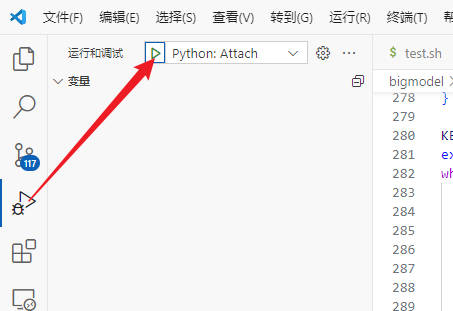

#
<!--more-->


# 4 - 带bash脚本的python项目调试（stable diffsuion）


- 项目中使用bash脚本运行python代码，如何调试。以stable diffsuion webui forge为例，使用vscode。


## 4.1 安装包debugpy包

- 注意你使用的是本地环境还是虚拟环境

```bash
pip install debugpy
```


## 4.2 修改配置文件

- vscode中`ctrl + p`，输入`>lanuch.json`回车，打开配置文件，添加如下代码：

  ```json
  {
  	"version": "0.2.0",
  	"configurations": [
  
  		{
  			"name": "Python: Attach",
  			"type": "debugpy",
  			"request": "attach",
  			"connect": {
  				"host": "localhost",
  				"port": xxxx //此处为空闲端口号
  			}
  		}
  	]
  } 
  
  ```

  

## 4.3 修改bash启动脚本

- 将启动脚本的运行语句改成：

  ```bash
  python -m debugpy --listen localhost:xxxx --wait-for-client \
          main.py \ # 要运行的文件
          --参数等等 \
  ```

  - 以stable diffusion webui forge为例，修改webui.sh:

    - 开头加上：

      ```bash
      ifdebug=true
      debug_port=xxxx #端口号与前面对应
      ```

    - 翻到最后，将`"${python_cmd}" -u "${LAUNCH_SCRIPT}" "$@"`改成：

      ```bash
      if [[ "${ifdebug}" = "true" ]]; then
          "${python_cmd}" -m debugpy --listen "${debug_port}" --wait-for-client "${LAUNCH_SCRIPT}" "$@"
      else
          "${python_cmd}" -u "${LAUNCH_SCRIPT}" "$@"
      fi
      ```

      

## 4.4 运行

- 在vscode中打开终端，运行bash脚本

- 运行后点击调试，python: Remote Attach

  

  