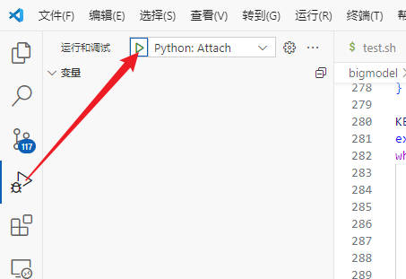

#

<!--more-->


#1. 安装包debugpy包

- 注意你使用的是本地环境还是虚拟环境

```bash
pip install debugpy
```


#2. 修改配置文件

- vscode中`ctrl + p`，输入`>lanuch.json`回车，打开配置文件，添加如下代码：

  ```json
  {
  	"version": "0.2.0",
  	"configurations": [
  
  		{
  			"name": "Python: Attach",
  			"type": "debugpy",
  			"request": "attach",
  			"connect": {
  				"host": "localhost",
  				"port": xxxx //此处为空闲端口号
  			}
  		}
  	]
  } 
  
  ```


#3. 启动

- 纯python语句：

  ```bash
  python -m debugpy --listen localhost:xxxx --wait-for-client main.py --参数等等
  ```
  
- `torchrun`

  ```shell
  python -m debugpy --listen localhost:5678 --wait-for-client $(which torchrun) --nnodes=1 --nproc_per_node=1 train.py --config configs/training/v1/config.yaml
  ```

  - 网上看到的也有用：
  
    ```shell
    python -m debugpy --connect 5678 $(which torchrun) --nproc_per_node=2 ddp_demo.py
    ```
  
    

#4. 运行

- 在vscode中打开终端，运行bash脚本

- 运行后点击调试，python: Remote Attach

  

  

- 如果无法运行，可以尝试将`lanuch.json`中的`debugpy`改成`debugpy-old`， 或者查看你的远端的python扩展是不是显示有问题，把他卸载重装。

